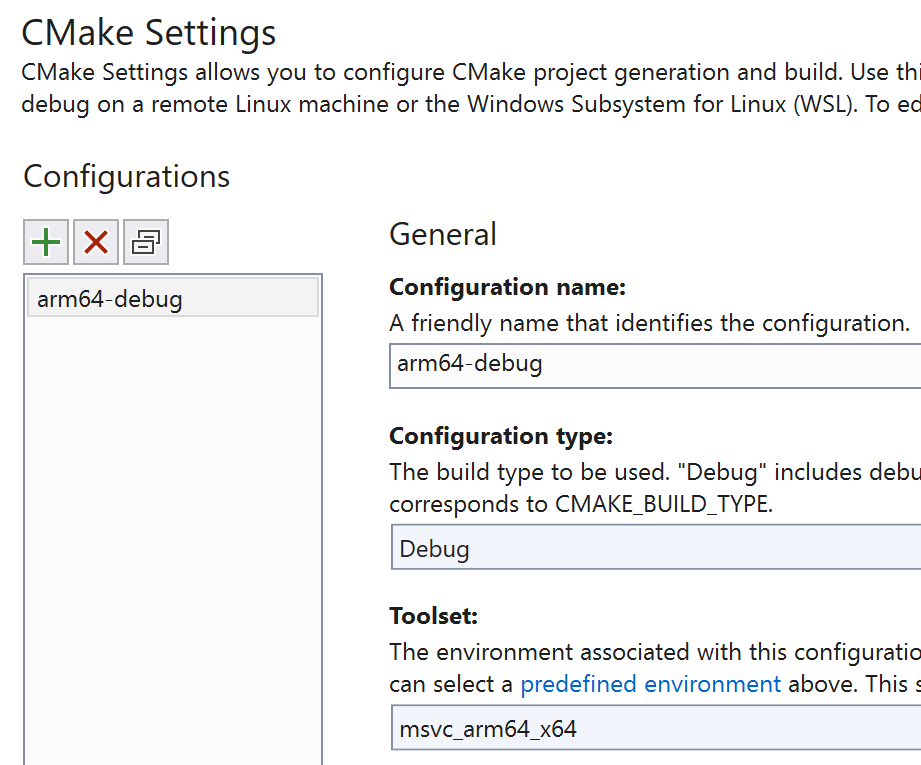

# Tutorial: Run and debug a CMake project on a remote machine

This tutorial shows how to use Visual Studio for C++ on Windows to create and build a CMake project on x86 Windows, and then deploy it to run on an ARM device. In this tutorial, you'll deploy and run on an ARM device, but you could just as easily deploy and run on a Linux or other Windows device.

In this tutorial, you learn how to:

> [!div class="checklist"]
>
> * create a CMake project
> * configure it to build for ARM
> * configure debugging for a remote ARM device
> * build and debug the target on a remote ARM device

## Prerequisites

### On the host machine

Setup Visual Studio for cross-platform C++ development by installing the ARM build tools:

    VS installer > Modify > Individual Components
    In the **Compilers, build tools, and runtimes** section install
        C++ ARM64 build tools (v14.28)

### On the target machine

Install the remote debugging tools on the remote machine. This tutorial targets ARM, so install the ARM version of the Visual Studio 2019 remote debugging tools.
[link to download](https://visualstudio.microsoft.com/downloads/#remote-tools-for-visual-studio-2019)

## Create a CMake project

On the Windows host machine, run Visual Studio and choose **Create new project** > **CMake Project** > **Next**
Give the project a name and choose a location. Then select **Create**.

Give Visual Studio a few moments to create the project and populate the Solution Explorer.

## Change the configuration to target ARM

In the **Configuration** dropdown, choose **Manage Configurations...**


Change the **Configuration name** to **x64arm-debug**. This is to make it clear that we've modified this configuration to target ARM.

Change the **Toolset** dropdown to **msvc_arm64_x64**. Your settings should look something like this:



> [!Note]
> In the **Toolset** dropdown, **msvc_arm** builds for 32-bit ARM, **msvc_arm64** builds for 64-bit ARM, and **msvc_arm64 x64** builds for 64-bit ARM from an x64 host--which is what you are doing in this tutorial.

## Add a debug configuration file

To configure the project to debug remotely on another machine, first change the **Solution Explorer** view to targets view by selecting the **Switch Views** button in the **Solution Explorer**:


Then double-click **CMake Targets View**. The **CMake Targets View** appears.

In the **Solution Explorer**, right-click the executable and select **Add Debug Configuration**.


This creates a `launch.vs.json` file. Change the following entries to enable remote debugging:

`projectTarget` : set to the name of your executable, for example, `CMakeProject1`
`remoteMachineName` : set to either the IP address, or the machine name, of your remote ARM machine or ARM virtual machine.

## Start the remote debugger monitor on the ARM device

Before you run your CMake project, ensure that the Visual Studio 2019 remote debugger is running on the remote ARM machine.  You may need to change the options depending on your authentication situation. 

From the VS Remote Debugger, set authentication to match how your environment is setup:


If you choose **No Authentication**, in the `launch.vs.json` file, add **"windowsAuthenticationType": "Remote Windows with No authentication"** to the `configurations` section `launch.vs.json`. For example:

``` XAML
{
  "version": "0.2.1",
  "defaults": {},
  "configurations": [
    {
        "type": "remoteWindows",
        "windowsAuthenticationType": "Remote Windows with No authentication"
        "name": "CMakeLists.txt",
        "project": "CMakeLists.txt",
        "projectTarget": "CMakeProject1",
        "remoteMachineName": "<ip address goes here>",
        "cwd": "${debugInfo.defaultWorkingDirectory}",
        "program": "${debugInfo.fullTargetPath}",
        "deploy": [],
        "args": [],
        "env": {}
    },
    {
      "type": "default",
      "project": "CMakeLists.txt",
      "projectTarget": "CMakeProject3.exe",
      "name": "CMakeProject3.exe"
    }
  ]
}
```

Otherwise, `"windowsAuthenticationType"` defaults to `"Remote Windows authentication"` and doesn't need to be explicitly stated.

## Debug the app

In the **Solution Explorer**, open the CPP file. If you are still in **CMake Targets View**, you'll need to open the **(executable)** node to see it.

The default CPP file is a simple hello world console app. Set a breakpoint on the `return 0;` line so that the program doesn't quickly run and close on the remote machine.

On the Visual Studio toolbar, use the startup item dropdown to change the startup item to match the name you specified for `"name"` in the `launch.vs.json` file:


From the VS toolbar, choose **Debug** > **Start Debugging** (or press **F5**)

If it doesn't start, ensure that the following are set correctly in the launch.vs.json file:
- `"remoteMachineName"` set to the IP address or name of the remote machine
- `"name"` is what your startup item in Visual Studio is set to
- `"projectTarget"` is set to the name of the executable
- `"type"` is set to `"remoteWindows"`
- If your authentication type on the remote debugger is set to **No Authentication**, that you have `"windowsAuthenticationType": "Remote Windows with No authentication"` set in the `launch.vs.json` file.

After the project builds, the app should appear on the remote ARM machine:


## What you learned

In this tutorial, you created a CMake project, configured it to build for ARM and to run on a remote machine. Then you built, ran, and debugged it on a remote ARM device.

## Next steps

Learn more about configuring and debugging CMake projects in Visual Studio:

> [!div class="nextstepaction"]
> [CMake Projects in Visual Studio](cmake-projects-in-visual-studio.md)<br/><br/>
> [Customize CMake build settings](customize-cmake-settings.md)<br/><br/>
> [Configure CMake debugging sessions](configure-cmake-debugging-sessions.md)<br/><br/>
> [CMake predefined configuration reference](cmake-predefined-configuration-reference.md)
