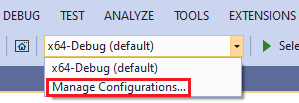
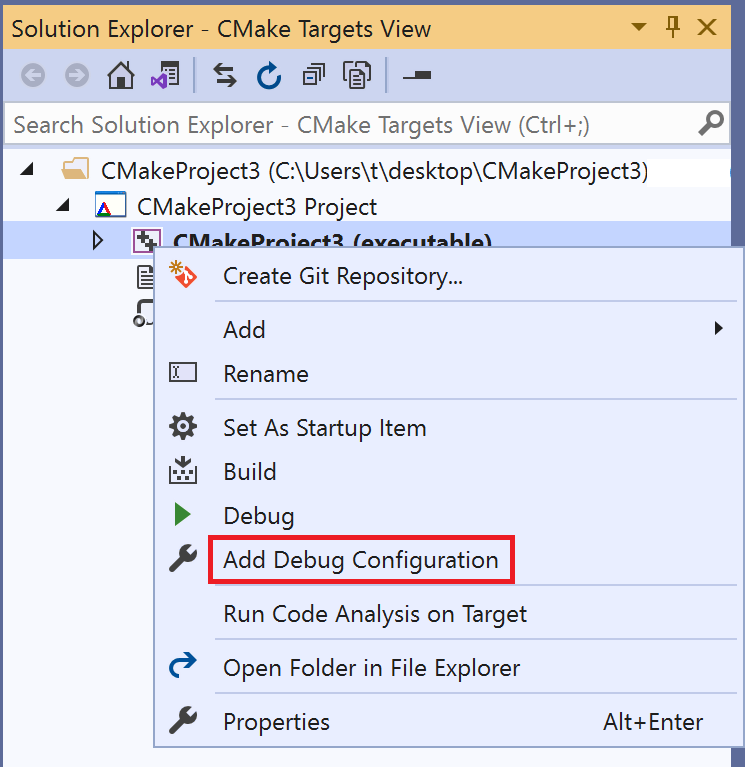
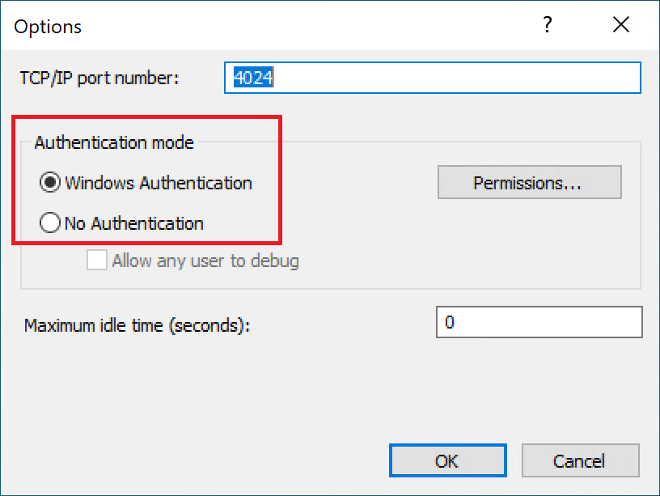

# Tutorial: Run and debug a CMake project on a remote machine

This tutorial shows how to use Visual Studio C++ on Windows to create and build a CMake project than you can deploy and debug on an ARM64 device. The steps can be generalized to deploy and debug a CMake project that doesn't target ARM64.

This tutorial focuses on ARM64 because the default debugging experience for ARM64 is remote debugging. Attempting to debug ARM64 without configuring your CMake project as shown in this tutorial will result in an error that VS can't find the remote machine.

In this tutorial, you'll learn how to:

> [!div class="checklist"]
>
> * create a CMake project
> * configure a CMake project to build for ARM64
> * configure a CMake project to run on a remote ARM64 device
> * debug a CMake project running on a remote ARM64 device

## Prerequisites

### On the host machine

Set up Visual Studio for cross-platform C++ development by installing the ARM64 build tools:

Todo! VS installer > Modify > Individual Components
    In the **Compilers, build tools, and runtimes** section install
        C++ ARM64 build tools (v14.28)

### On the remote machine

Install the remote debugging tools on the remote machine. 

ToDo! This tutorial targets ARM64, so install the ARM64 version of the Visual Studio 2019 remote debugging tools.
[link to download](https://visualstudio.microsoft.com/downloads/#remote-tools-for-visual-studio-2019)

## Create a CMake project

On the Windows host machine, run Visual Studio and choose **Create new project** > **CMake Project** > **Next**
Give the project a name and choose a location. Then select **Create**.

Give Visual Studio a few moments to create the project and populate the **Solution Explorer**.

## Change the configuration to target ARM64

Because you are targeting an ARM64 device, you need to use the ARM64 build tools. To select the ARM64 build tools, select the Visual Studio **Configuration** dropdown and select **Manage Configurations...**



Change the **Configuration name** to **arm64-debug**. This is a unique, friendly name to make it easier for you to identify these settings.

Select the **Toolset** dropdown and from the list of build tools, choose **msvc_arm64_x64**. Your settings should look something like this:


> [!Note]
> In the **Toolset** dropdown, **msvc_arm64** builds for 64-bit ARM, and **msvc_arm64 x64** uses the 64-bit host tools to cross-compile for ARM64--which is what you will do in this tutorial.

## Add a debug configuration file

Next, add configuration information that tells Visual Studio where to find your remote machine, and other configuration details.

Change the **Solution Explorer** view to targets view by selecting the **Switch Views** button:


Then double-click **CMake Targets View**. The **CMake Targets View** appears.

In the **Solution Explorer**, right-click the executable and select **Add Debug Configuration**:



This creates a `launch.vs.json` file in your project. Open it and change the following entries to enable remote debugging:

- `projectTarget` : set to the name of your executable; for example, `CMakeProject3`
- `remoteMachineName` : set to the IP address of the remote ARM64 machine, or its machine name.

## Start the remote debugger monitor on the ARM64 device

Before you run your CMake project, ensure that the Visual Studio 2019 remote debugger is running on the remote ARM64 machine.  You may need to change the remote debugger options depending on your authentication situation.

From the VS Remote Debugger menu bar, select **Tools** > **Options**. Then set authentication to match how your environment is set up:



If you choose **No Authentication**, update the `launch.vs.json` file in your project by adding **"windowsAuthenticationType": "Remote Windows with No authentication"** to the `configurations` section `launch.vs.json`. For example:

``` XAML
{
  "version": "0.2.1",
  "defaults": {},
  "configurations": [
    {
        "type": "remoteWindows",
        "windowsAuthenticationType": "Remote Windows with No authentication"
        "name": "CMakeLists.txt",
        "project": "CMakeLists.txt",
        "projectTarget": "CMakeProject1",
        "remoteMachineName": "<ip address goes here>",
        "cwd": "${debugInfo.defaultWorkingDirectory}",
        "program": "${debugInfo.fullTargetPath}",
        "deploy": [],
        "args": [],
        "env": {}
    },
    {
      "type": "default",
      "project": "CMakeLists.txt",
      "projectTarget": "CMakeProject3.exe",
      "name": "CMakeProject3.exe"
    }
  ]
}
```

Otherwise, `"windowsAuthenticationType"` defaults to `"Remote Windows authentication"` and doesn't need to be explicitly stated.

## Debug the app

On the host machine, in the Visual Studio **Solution Explorer**, open the CPP file for your CMake project. If you're still in **CMake Targets View**, you'll need to open the **(executable)** node to see it.

The default CPP file is a simple hello world console app. Set a breakpoint on `return 0;` so that the program doesn't quickly run and close on the remote machine.

On the Visual Studio toolbar, use the startup item dropdown to change the startup item to match the name you specified for `"name"` in the `launch.vs.json` file:


To start debugging, on the VS toolbar choose **Debug** > **Start Debugging** (or press **F5**).

If it doesn't start, ensure that the following are set correctly in the `launch.vs.json` file:
- `"remoteMachineName"` should be set to the IP address, or machine name, of the remote ARM64 device.
- `"name"` should match the selection in the VS startup item dropdown.
- `"projectTarget"` should be set to the name of the executable file.
- `"type"` should be set to `"remoteWindows"`
- If the authentication type on the remote debugger is set to **No Authentication**, you should have `"windowsAuthenticationType": "Remote Windows with No authentication"` set in the `launch.vs.json` file.

After the project builds, the app should appear on the remote ARM64 machine:


## What you learned

In this tutorial, you created a CMake project, configured it to build for ARM64 and to run on a remote machine. Then you built, ran, and debugged it on a remote ARM64 device.

## Target other platforms.


## Next steps

Learn more about configuring and debugging CMake projects in Visual Studio:

> [!div class="nextstepaction"]
> [CMake Projects in Visual Studio](cmake-projects-in-visual-studio.md)<br/><br/>
> [Customize CMake build settings](customize-cmake-settings.md)<br/><br/>
> [Configure CMake debugging sessions](configure-cmake-debugging-sessions.md)<br/><br/>
> [CMake predefined configuration reference](cmake-predefined-configuration-reference.md)
