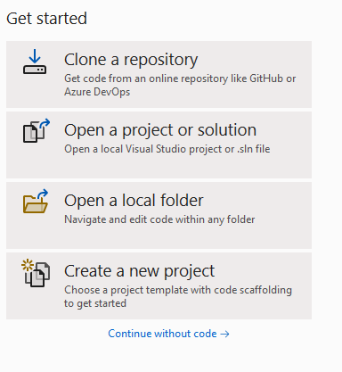
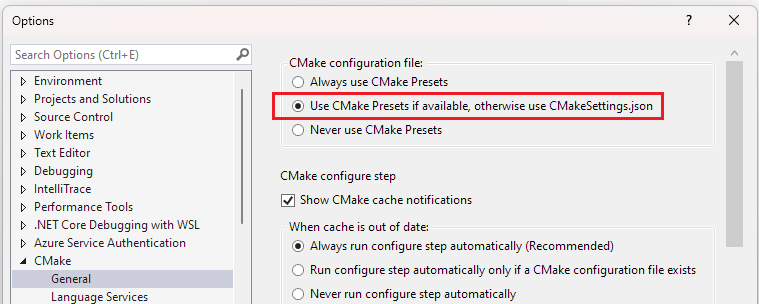
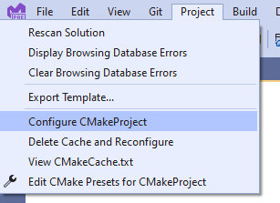
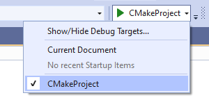
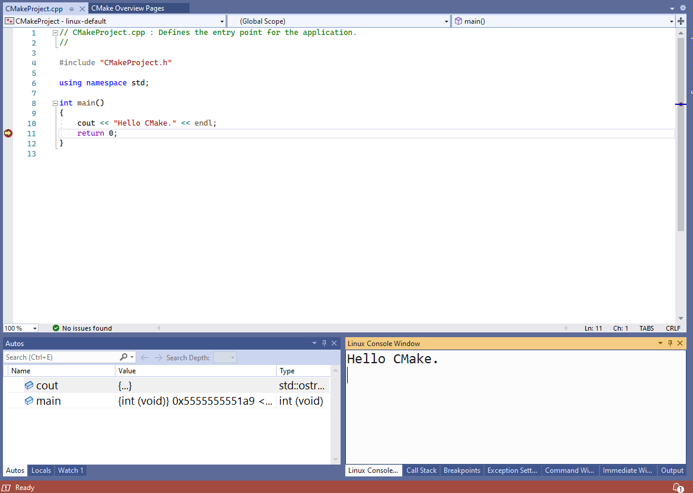

# Walkthrough: Build and debug C++ with WSL 2 and Visual Studio 2022

Visual Studio 2022 introduces a native C++ toolset for Windows Subsystem for Linux version 2 (WSL 2) development. This toolset is available now in [Visual Studio 2022 version 17.0 Preview 2](https://visualstudio.microsoft.com/vs/preview/vs2022/) or higher.

WSL 2 is the new, recommended version of the [Windows Subsystem for Linux](/windows/wsl/about) (WSL). It provides better Linux file system performance, GUI support, and full system call compatibility. Visual Studio’s WSL 2 toolset allows you to use Visual Studio to build and debug C++ code on WSL 2 distros without adding a SSH connection. You can already build and debug C++ code on WSL 1 distros using the native [WSL 1 toolset](https://devblogs.microsoft.com/cppblog/c-with-visual-studio-2019-and-windows-subsystem-for-linux-wsl/) introduced in Visual Studio 2019 version 16.1.

Visual Studio’s WSL 2 toolset supports both CMake and MSBuild-based Linux projects. CMake is our recommendation for all C++ cross-platform development with Visual Studio. We recommend CMake because it build and debug the same project on Windows, WSL, and remote systems.

For a video presentation of the information in this topic, see [Video: Debug C++ with WSL 2 Distributions and Visual Studio 2022.](https://youtu.be/IKI2w75aAow)

## WSL 2 toolset background

 C++ cross-platform support in Visual Studio assumes all source files originate in the Windows file system. When targeting a WSL 2 distro, Visual Studio will execute a local `rsync` command to copy files from the Windows file system to the WSL file system. The local `rsync` copy doesn't require any user intervention. It occurs automatically when Visual Studio detects you're using a WSL 2 distro. To learn more about the differences between WSL 1 and WSL 2, see [Comparing WSL 1 and WSL 2](/windows/wsl/compare-versions).

The WSL 2 toolset is supported by CMake Presets integration in Visual Studio. To learn more, see [CMake Presets integration in Visual Studio and Visual Studio Code](https://devblogs.microsoft.com/cppblog/cmake-presets-integration-in-visual-studio-and-visual-studio-code/) and [Configure and build with CMake Presets in Visual Studio](cmake-presets-vs.md). There's also more advanced information in this article under [Advanced WSL 2 and CMake projects considerations](walkthrough-build-debug-wsl2.md#advanced-wsl-2-and-cmake-projects-considerations).

## Install the build tools

Install the tools necessary to build and debug on WSL 2. You'll install a recent version of CMake using Visual Studio’s CMake binary deployment in a later step.

1. Install WSL and a WSL 2 distro by following the instructions at [Install WSL](/windows/wsl/install-win10).
1. Assuming your distro uses `apt` (this walkthrough uses Ubuntu), use the following commands to install the required build tools on your WSL 2 distro:

    ```bash
    sudo apt update
    sudo apt install g++ gdb make ninja-build rsync zip
    ```

    The `apt` commands above install:
    
    * A C++ compiler
    * `gdb`
    * `CMake`
    * `rsync`
    * `zip`
    * An underlying build system generator

## Cross-platform CMake development with a WSL 2 distro

This walkthrough uses GCC and Ninja on Ubuntu. And Visual Studio 2022 version 17.0 Preview 2 or later.

Visual Studio defines a CMake project as a folder with a `CMakeLists.txt` file at the project root. In this walkthrough, you'll create a new CMake project by using the Visual Studio **CMake Project** template:

3. From the Visual Studio **Get started** screen, select **Create a new project**.

    

4. In the **Search for templates** textbox, type "cmake".  Choose the **CMake Project** type and select **Next**. Give the project a name and location, and then select **Create**.

5. Enable Visual Studio’s CMake Presets integration. Select **Tools** > **Options** > **CMake** > **General**. Select **Prefer using CMake Presets for configure, build, and test**, then select **OK**. Instead, you could have added a `CMakePresets.json` file to the root of the project. For more information, see [Enable CMake Presets integration](cmake-presets-vs.md#-enable--cmakepresetsjson-integration-in-visual-studio-2019).

    

6. To activate the integration: from the main menu, select **File** > **Close Folder**. The **Get started** page appears. Under **Open recent**, select the folder you just closed to reopen the folder.

7. There are three dropdowns across the Visual Studio main menu bar. Use the dropdown on the left to select your active target system. This is the system where CMake will be invoked to configure and build the project. Visual Studio queries for WSL installations with `wsl -l -v`. In the following image, **WSL2: Ubuntu-20.04** is shown selected as the **Target System**.

    

    > [!NOTE]
    > If Visual Studio starts to configure your project automatically, read step 11 to manage CMake binary deployment, and then continue to the step below. To customize this behavior, see [Modify automatic configuration and cache notifications](cmake-presets-vs.md#modify-automatic-configuration-and-cache-notifications).

8. Use the dropdown in the middle to select your active Configure Preset. Configure Presets tell Visual Studio how to invoke CMake and generate the underlying build system. In step 7, the active Configure Preset is the **linux-default** Preset created by Visual Studio. To create a custom Configure Preset, select **Manage Configurations…** For more information about Configure Presets, see [Select a Configure Preset](cmake-presets-vs.md#select-a-configure-preset) and [Edit Presets](cmake-presets-vs.md#edit-presets).

    

9. Use the dropdown on the right to select your active Build Preset. Build Presets tell Visual Studio how to invoke build. In the illustration for step 7, the active Build Preset is the **Default** Build Preset created by Visual Studio. For more information about Build Presets, see [Select a Build Preset](cmake-presets-vs.md#select-a-build-preset).

10. Configure the project on WSL 2. If project generation doesn't start automatically, then manually invoke configure with **Project** > **Configure** *project-name*

    

11. If you don't have a supported version of CMake installed on your WSL 2 distro, then Visual Studio will prompt you beneath the main menu ribbon to deploy a recent version of CMake. Select **Yes** to deploy CMake binaries to your WSL 2 distro.

    

12. Confirm that the configure step has completed and that you can see the **CMake generation finished** message in the **Output** window under the **CMake** pane. Build files are written to a directory in the WSL 2 distro’s file system.

    

13. Select the active debug target. The debug dropdown menu lists all the CMake targets available to the project.

    

14. Expand the project subfolder in the **Solution Explorer**. In the `CMakeProject.cpp` file, set a breakpoint in `main()`. You can also navigate to CMake targets view by selecting the View Picker button in the **Solution Explorer**, highlighted in following screenshot:

    

15. Select **Debug** > **Start**, or press **F5**. Your project will build, the executable will launch on your WSL 2 distro, and Visual Studio will stop execution at the breakpoint. You can see the output of your program (in this case, `"Hello CMake."`) in the Linux Console Window:

    

You've now built and debugged a C++ app with WSL 2 and Visual Studio 2022.

## Advanced WSL 2 and CMake projects considerations

Visual Studio only provides native support for WSL 2 for CMake projects that use `CMakePresets.json` as the active configuration file. To migrate from `CMakeSettings.json` to `CMakePresets.json`, see [Enable CMake Presets integration in Visual Studio](cmake-presets-vs.md#-enable--cmakepresetsjson-integration-in-visual-studio-2019).

If you're targeting a WSL 2 distribution and you don't want to use the WSL 2 toolset, then in the Visual Studio Remote Settings vendor map in `CMakePresets.json`, set **forceWSL1Toolset** to **true** . See [Visual Studio Remote Settings vendor map](cmake-presets-json-reference.md#visual-studio-remote-settings-vendor-map) for details.

If **forceWSL1Tooslet** is set to **true**, then Visual Studio won't maintain a copy of your source files in the WSL file system. Instead, it will access source files in the mounted Windows drive (`/mnt/`…).

In most cases, it’s best to use the WSL 2 toolset with WSL 2 distributions because WSL 2 is slower when project files are instead stored in the Windows file system. To learn more about file system performance in WSL 2, see [Comparing WSL 1 and WSL 2](/windows/wsl/compare-versions).

Specify advanced settings such as the path to the directory on WSL 2 where the project will be copied, copy source options, and rsync command arguments, in the Visual Studio Remote Settings vendor map in `CMakePresets.json`. See [Visual Studio Remote Settings vendor map](cmake-presets-json-reference.md#visual-studio-remote-settings-vendor-map) for details.

System headers are still automatically copied to the Windows file system to supply the native IntelliSense experience. You can customize the headers that are included or excluded from this copy in the Visual Studio Remote Settings vendor map in `CMakePresets.json`.

You can change the IntelliSense mode, or specify other IntelliSense options, in the Visual Studio Settings vendor map in `CMakePresets.json`. For details about the vendor map, see [Visual Studio Remote Settings vendor map](cmake-presets-json-reference.md#visual-studio-remote-settings-vendor-map).

## WSL 2 and MSBuild-based Linux projects

CMake is recommended for all C++ cross-platform development with Visual Studio because it allows you to build and debug the same project on Windows, WSL, and remote systems. If you're already using a MSBuild-based Linux project, then you can upgrade to the WSL 2 toolset in Visual Studio via **Property pages** > **General** > **Platform Toolset**:


If you're targeting a WSL 2 distribution and you don't want to use the WSL 2 toolset, then in **Property Pages** > **General** > **Platform Toolset**, select the **GCC for Windows Subsystem for Linux** or **Clang for Windows Subsystem for Linux** toolset. If either of these toolsets are selected, Visual Studio won't maintain a copy of your source files in the WSL file system and will instead access source files over the mounted Windows drive (`/mnt/`…). System headers are still automatically copied to the Windows file system to provide a native IntelliSense experience. Customize the headers that are included or excluded from this copy in **Property Pages** > **General**.

In most cases, it’s best to use the WSL 2 toolset with WSL 2 distributions because WSL 2 is slower when project files are stored in the Windows file system. To to learn more, see [Comparing WSL 1 and WSL 2](/windows/wsl/compare-versions).

## See also

[Video: Debug C++ with WSL 2 Distributions and Visual Studio 2022](https://youtu.be/IKI2w75aAow)\
[Download Visual Studio 2022 preview](https://visualstudio.microsoft.com/vs/preview/)\
[Create a CMake Linux project in Visual Studio](../linux/cmake-linux-project.md)\
[Tutorial: Debug a CMake project on a remote Windows machine](cmake-remote-debugging.md)