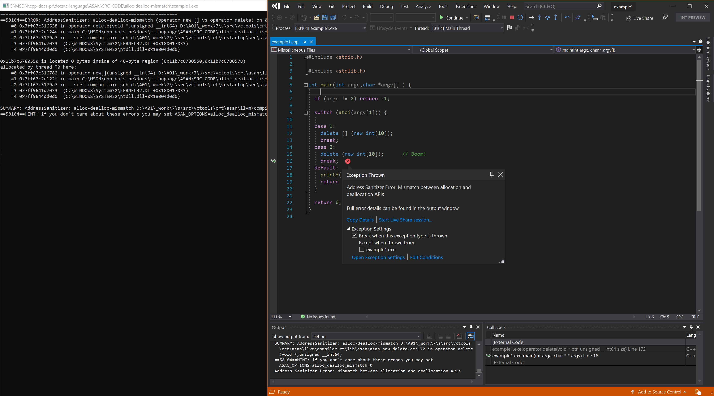

# Alloc dealloc mismatch

This is not on by default for Windows. So you will have to `set ASAN_OPTIONS=alloc_dealloc_mismatch=1` prior to running the program. This flag will report errors on malloc/delete, new/free, new/delete[] etc. 


## Example
```cpp
#include <stdio.h>
#include <stdlib.h>

int main(int argc,char *argv[] ) {

  if (argc != 2) return -1;

  switch (atoi(argv[1])) {

  case 1: 
    delete [] (new int[10]);  
    break;
  case 2: 
    delete (new int[10]);      // Boom!
    break;
  default: 
    printf("arguments: 1: no error 2: runtime error\n");
    return -1;
  }

  return 0;
}
```

## Resulting error

The following output resulted from the command line: `devenv /debugexe example1.exe 2`



