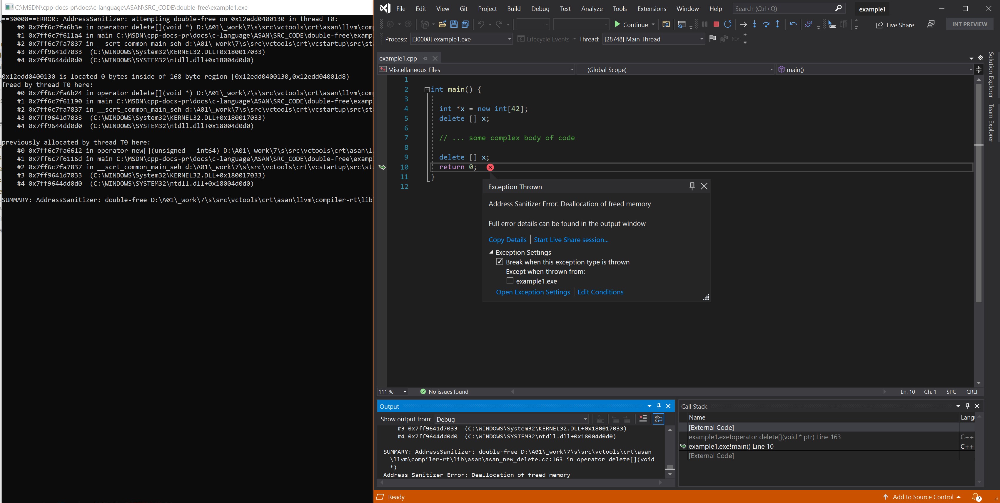

# Double free

In 'C' you can call free() erroneously and in 'C++' you can similarly call delete more than once. In the last example we also show and example at the Windows specific, HeapCreate(), level of abstraction.

## Example C++ - double operator delete

```cpp
int main() {
  int *x = new int[42];
  delete [] x;

  // ... some complex body of code

  delete [] x;
  return 0;
}
```
## Resulting error



## Example 'C' - double fre()
```cpp
#include <stdlib.h>
#include <string.h>

int main(int argc, char **argv) {

  char *x = (char*)malloc(10 * sizeof(char));
  memset(x, 0, 10);
  int res = x[argc];
  free(x);

  // ... some complex body of code

  free(x + argc - 1);  // Boom!
  return res;
}
```

## Resulting error


## Example - Windows HeapCreate() double free
```cpp
#include <Windows.h>
#include <stdio.h>


int main() {
    void* newHeap = HeapCreate(0, 0, 0);
    void* newAlloc = HeapAlloc(newHeap, 0, 100);

    HeapFree(newHeap, 0, newAlloc);
    HeapFree(newHeap, 0, newAlloc);
    printf("failure\n");
    return 1;
}
```

## Resutling error


