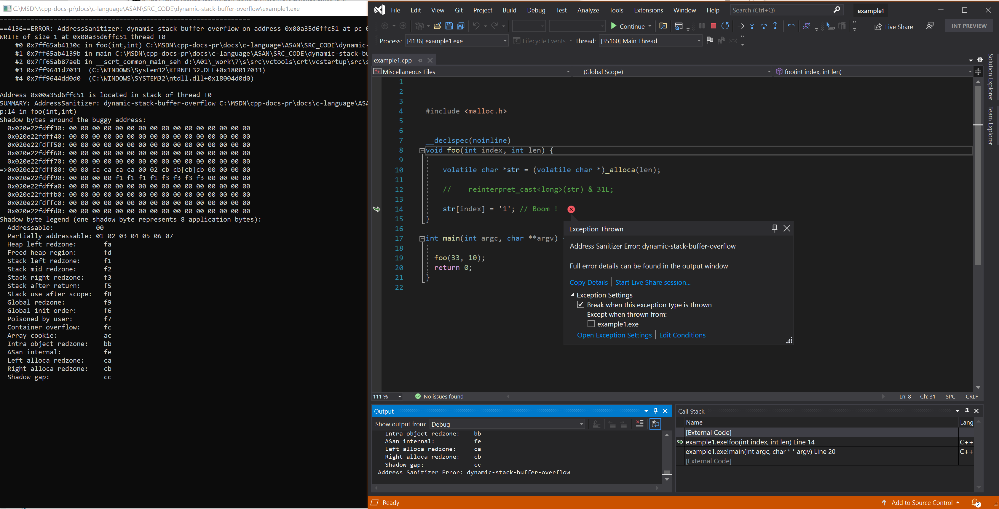
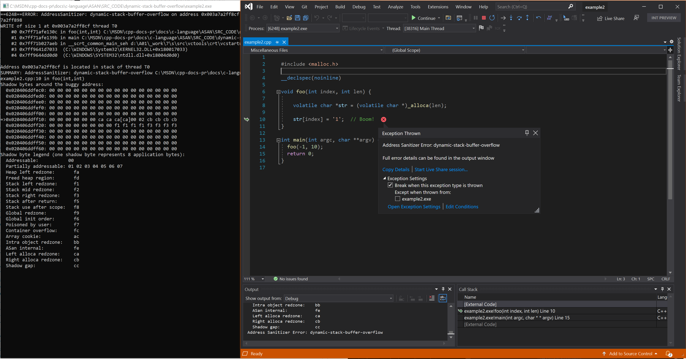
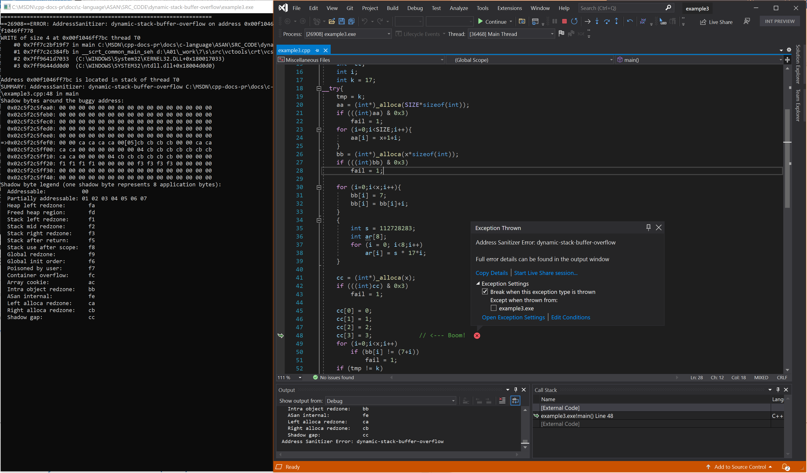

# Alloca - dynamic-stack-overflow

## example - alloca overflow (right)

```cpp

#include <malloc.h>

__declspec(noinline)

void foo(int index, int len) {

    volatile char *str = (volatile char *)_alloca(len);
    
    str[index] = '1'; // Boom !
}

int main(int argc, char **argv) {

  foo(33, 10);
  return 0;
}
```

## Resulting error



## example - alloca overflow (left)

```cpp


#include <malloc.h>

__declspec(noinline)

void foo(int index, int len) {
    volatile char *str = (volatile char *)_alloca(len);

    str[index] = '1';  // Boom!
}

int main(int argc, char **argv) {
  foo(-1, 10);
  return 0;
}
```

## Resulting error - alloca overflow (left)



## Example - several calls to alloca

Here's the complete example from the introduction section on the Address Sanitizer

```cpp
#include <stdio.h>
#include <stdlib.h>

#include <malloc.h>


#define SIZE 7
extern void nothing();
int x=13,*aa,*bb,y=0;
int fail = 0;
int tmp;

void main()
{
    int *cc;
    int i;
    int k = 17;
__try{
    tmp = k;
    aa = (int*)_alloca(SIZE*sizeof(int));
    if (((int)aa) & 0x3)
        fail = 1;
    for (i=0;i<SIZE;i++){
        aa[i] = x+1+i;
    }
    bb = (int*)_alloca(x*sizeof(int));
    if (((int)bb) & 0x3)
        fail = 1;

    for (i=0;i<x;i++){
        bb[i] = 7;
        bb[i] = bb[i]+i;
    }
    {
        int s = 112728283;
        int ar[8];
        for (i = 0; i<8;i++)
            ar[i] = s * 17*i;
    }

    cc = (int*)_alloca(x);
    if (((int)cc) & 0x3)
        fail = 1;

    cc[0] = 0;
    cc[1] = 1;
    cc[2] = 2;
    cc[3] = 3;             // <--- Boom!
    for (i=0;i<x;i++)
        if (bb[i] != (7+i))
            fail = 1;
    if (tmp != k)
        fail = 1;
    if (fail){
        printf("fail\n");
        exit(7);
    }
    printf("%d\n",(*cc)/y);
    printf("fail\n");
    exit(7);
} __except (1)
            
  {

    for (i=0;i<SIZE;i++)
        if (aa[i] != (x+i+1))
            fail = 1;
    if (fail){
        printf("fail\n");
        exit(7);
    }
    printf("pass\n");
    exit(0);
  }
}

```

## Resulting error - several calls to alloca


