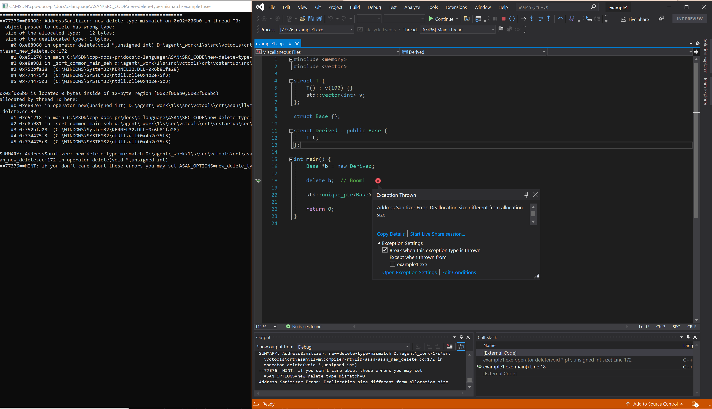

# New delete type mismatch

In the following C++ example only ~Base, not ~Derived is called. This is because Base's dtor is not virtual. When we `delete b`, the destructor is hard wired by default, to delete an empty base class (or 1-byte on Windows). This is an error common to C++ inheritance.

## Example - virtual destructor

```cpp
#include <memory>
#include <vector>

struct T {
    T() : v(100) {}
    std::vector<int> v;
};

struct Base {};

struct Derived : public Base {
    T t;
};

int main() {
    Base *b = new Derived;

    delete b;  // Boom! 

    std::unique_ptr<Base> b1 = std::make_unique<Derived>();

    return 0;
}
```
Polymorphic base classes should declare **virtual destructors**. If a class has any virtual functions, it should have a virtual destructor

Fix this example by adding:
```cpp
struct Base {
  virtual ~Base() = default;
}
```

## Resulting error


