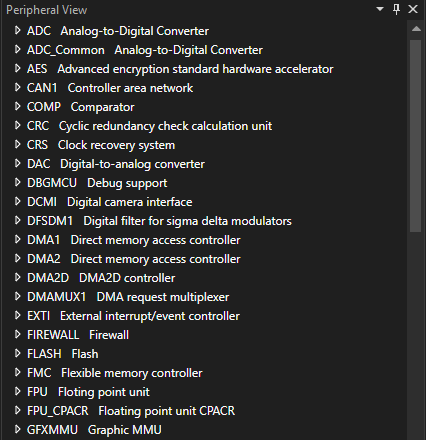
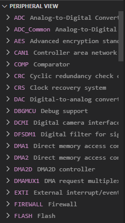

# Peripheral View

## Overview

The Peripheral View allows embedded developers to view and manipulate registers and peripherals defined SVD (System View Description) files.

|VS|VSCode|
|:-:|:-:|
|||

## Capabilities

|Capabilities|Description|Instructions|
|:-:|:-:|:-:|
|Navigation|Navigate the peripheral tree view by collapsing and expanding components in the tree view|Press the caret on each item to expand or collapse|
|Editing|Modify writeable peripheral values|Double click on the peripheral value to edit and press Enter to submit that value|
|Accessing memory|View the memory locations of peripherals|Click on the linked memory addresses|
|Pinning|Pin important peripherals to the top of the view|Click the pin icon to pin or unpin peripherals|

## Usage

### Navigating the view

The Peripheral View presents the registers in a tree-view. To navigate this view, scroll up and down to view the various peripherals and click the dropdown caret in order to view individual registers.

### Modifying register values

In order to modify peripheral values double click the value of the register, enter the desired value, and press enter to save the new value.

### Viewing the memory location of peripherals

Each peripheral has a memory address associated with it. The memory addresses are linked to an external viewer that allows you to inspect the memory. Click the linked memory address to navigate to it.

### Pinning

For peripherals that are more important, by clicking the pin icon on the peripheral, the Peripheral View will pin it to the top of the view, making it easy to view repeatedly.

## Accessibility

### Navigating the view

To navigate the tree-view, use the Arrow-Up and Arrow-Down keys to navigate through the peripherals and up and down the view. Use the Arrow-Right and Arrow-Left keys to expand and collapse peripherals.

### Modifying register values

To modify values, press Enter to select an item. Press F2 to start editing, Enter to commit the change, or Esc to cancel the change.

### Viewing the memory location of peripherals

To view memory address, press Enter to select an item. Tab until the memory address is selected. Press Enter to view the memory information.

### Pinning

To pin peripherals, press Enter to select an item, Tab to the pinning icon, and press Enter.