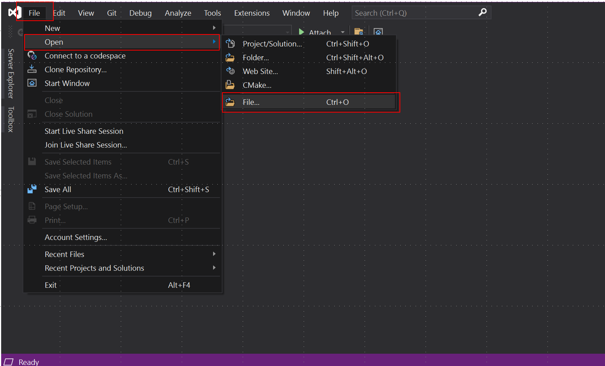
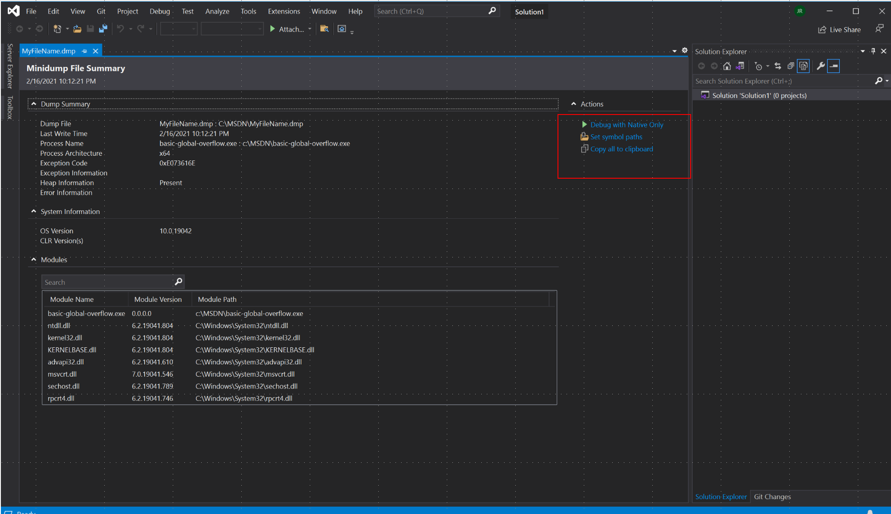
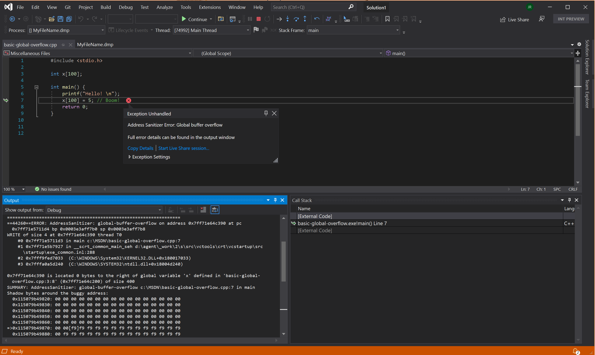

# AddressSanitizer - Cloud or distributed testing

When an AddressSanitizer error is found, a crash dump can be created to store all the AddressSanitizer-specific context. That crash dump can then be sent to another PC for debugging. It can be a critical time saver when running AddressSanitizer in the cloud or in distributed testing. You can create the dump on failure on that infrastructure and debug it on your developer PC.

The Visual Studio debugger provides precisely diagnosed AddressSanitizer errors. You can view these bugs without having to rerun testing, copy huge datasets, discover lost data, or find test machines that went offline. You only need to load the crash dump.

Crash dumps are created upon AddressSanitizer failures by setting the following environment variable:

`set ASAN_SAVE_DUMPS=MyFileName.dmp`

> [!NOTE]
> The file name must have a suffix *`.dmp`* to follow Visual Studio naming conventions.

This [dump file](/previous-versions/windows/desktop/proc_snap/export-a-process-snapshot-to-a-file) can be displayed by using Visual Studio at a later date on another machine.

Visual Studio can display the error information in the context of the original source code. To do so, Visual Studio requires [debugging symbols](/windows/win32/dxtecharts/debugging-with-symbols) and [indexed source code](/windows-hardware/drivers/debugger/source-indexing). For the best debugging experience, the EXE, PDB, and source code used to produce those binaries must match.

For more information about storing sources and symbols, see the [source and symbols](#Source-and-symbols) section. For information about implementation details and fine grained control, see [debugger integration](asan-debugger-integration.md).

## Example - build, test, and analyze

Consider three machines: A, B, and C. Builds are done on machine B, tests are run on machine C, and you analyze failures on machine A. The errors are reported against source line and column numbers in your source code. You can see the call stack together with a set of symbols in the PDB file produced using that [exact version of the source code](#Source-and-symbols).

The following steps are for local or distributed scenarios that lead to creation of a .dmp file, and for viewing that AddressSanitizer dump file offline.

### Produce a .dmp locally

- Build
- Test the executable
- Copy a generated .dmp file to the build directory
- Open the .dmp file with the paired .pdb, in the same directory

### Product a .dmp on a distributed system

- Build and [post-process the PDB](#Source-and-symbols) for [source indexing data blocks](/windows/win32/debug/source-server-and-source-indexing)
- Copy the atomic pair of (.exe, .pdb) to the test machine and run tests
- Write the atomic pairs of (.pdb, .dmp) to the bug-reporting database
- Visual Studio opens a .dmp file with the paired .pdb, in the same directory

> [!NOTE]
> The Visual Studio 2019 machine you use for analysis must have access to GitHub or the internal *`\\Machine\share`* where your indexed source is stored.

## View AddressSanitizer .dmp files

1. Make sure the debugger IDE can find your PDB and source files.

1. Open Visual Studio and select **Continue without code**. Then select **File** > **Open** > **File** to open the File Open dialog. Make sure the file name suffix is **.dmp**.

   

   The screen shown here needs one more step to enable the IDE access to symbols and source.

1. Set the symbol paths, and then choose **Debug with Native Only**.

   

This screenshot shows the final loaded dump file, with sources and AddressSanitizer metadata loaded.

## Source and symbols

Source server lets a client retrieve the **exact version** of the source files used to build an application. The source code for an executable or DLL can change over time, and between versions. It's important to look at the source code as it existed when a particular version of the code was built.

While debugging an EXE with its PDB file, the debugger can use the embedded source server data block to retrieve the appropriate files from source control. It loads the files that map to the fully qualified names put in the PDB automatically by the **`/Zi`** compiler option.

To use source server, the application must be "source indexed" by using pdbstr.exe to write a `srcsrv` data block into your PDB file. For more information, see the Data Block section of [Source server and source indexing](/windows/win32/debug/source-server-and-source-indexing). You'll find [the steps to index sources and publish symbols](/azure/devops/pipelines/tasks/build/index-sources-publish-symbols?view=azure-devops) and [how to specify symbols and source code for the debugger](/visualstudio/debugger/specify-symbol-dot-pdb-and-source-files-in-the-visual-studio-debugger?view=vs-2019) useful, too.

For external documentation, see:

- [Source indexing with Git](https://gist.github.com/baldurk/c6feb31b0305125c6d1a)
- [A guide to easier debugging](https://www.codeproject.com/articles/115125/source-indexing-and-symbol-servers-a-guide-to-easi)
- [Source Indexing is Underused Awesomeness](https://randomascii.wordpress.com/2011/11/11/source-indexing-is-underused-awesomeness/)

## See also

- [AddressSanitizer Overview](./asan.md)
- [AddressSanitizer Known Issues](./asan-known-issues.md)
- [AddressSanitizer Build and Language Reference](./asan-building.md)
- [AddressSanitizer Runtime Reference](./asan-runtime.md)
- [AddressSanitizer Shadow Bytes](./asan-shadowbytes.md)
- [AddressSanitizer Cloud or Distributed Testing](./asan-offline-crash-dumps.md)
- [AddressSanitizer Debugger Integration](./asan-debugger-integration.md)
