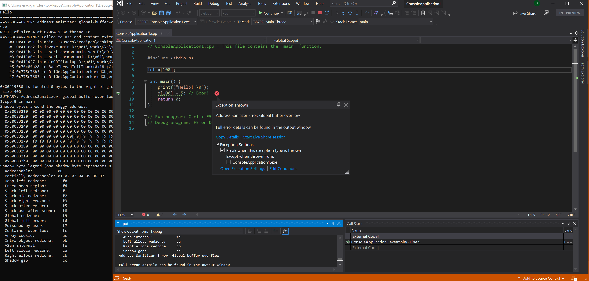
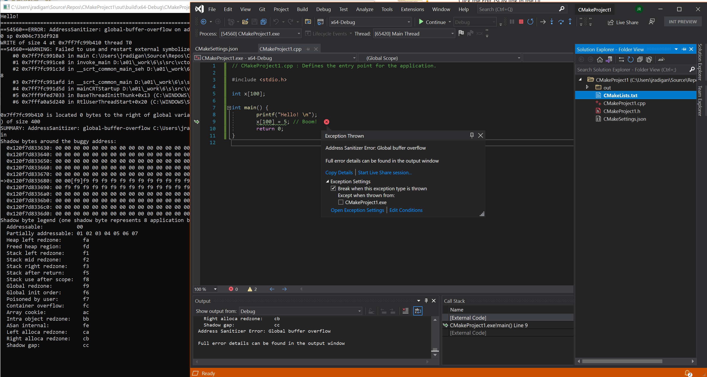

# AddressSanitizer

## Overview

The C & C++ languages are powerful, but can suffer from a class of bugs that affect **program correctness** and **program security**. Starting in Visual Studio 2019 version 16.9, the Microsoft C/C++ compiler (MSVC) and IDE supports the AddressSanitizer. This compiler and runtime technology exposes many [hard-to-find bugs](#error-types) with **zero false positives**.

Use this feature to reduce your time spent on:

- Basic correctness
- Cross platform portability
- Security
- Stress testing
- Integrating new code

The AddressSanitizer is a compiler and runtime [introduced by Google](https://www.usenix.org/conference/atc12/technical-sessions/presentation/serebryany). The [`/fsanitize=address`](../build/reference/fsanitize.md) compiler option is a powerful alternative to both [`/RTC`](../build/reference/rtc-run-time-error-checks.md) and [`/analyze`](../build/reference/analyze-code-analysis.md). It provides run-time bug-finding technologies that use your existing build systems and existing test assets directly.

Projects can enable the AddressSanitizer by setting a project property, or by using one extra compiler option: **`/fsanitize=address`**. The new option is compatible with all levels of optimization and configurations of x86 and x64, but it's incompatible with [edit-and-continue](/visualstudio/debugger/edit-and-continue-visual-cpp), [incremental linking](../build/reference/incremental-link-incrementally.md), and [`/RTC`](../build/reference/rtc-run-time-error-checks.md).

The AddressSanitizer is integrated with the Visual Studio project system, the CMake build system, and the IDE.

Microsoft's AddressSanitizer technology enables integration with the Visual Studio IDE. The functionality can optionally create a crash dump file when the sanitizer finds a bug at runtime. If you set the `ASAN_SAVE_DUMPS=MyFileName.dmp` environment variable before you run your program, a crash dump file gets created with extra metadata for efficient [post-mortem debugging](#AddressSanitizer-crash-dumps) of **precisely diagnosed bugs**. These dump files make extended use of the AddressSanitizer easier for:

- Local machine testing,
- On-premise distributed testing, and
- Cloud-based workflows for testing.

### Installing the AddressSanitizer

The AddressSanitizer is installed by default with C++ workloads in the Visual Studio Installer. However, if you're upgrading from an older version of Visual Studio 2019, you'll need to use the Installer to enable ASan support after the upgrade:


You can choose **Modify** on your existing Visual Studio installation from the Visual Studio Installer to get to the screen above.

> [!NOTE]
> If you run Visual Studio on the new update but haven't installed ASan, you'll get an error when you run your code:
>
> `LNK1356: cannot find library 'clang_rt.asan_dynamic-i386.lib'`

### Using the AddressSanitizer

Start building your executables with the **`/fsanitize=address`** compiler option using any of these common development methods:

- Command line
- Visual Studio project system
- Visual Studio CMake integration

 Recompile, then run your program normally. This code generation exposes [many types of precisely diagnosed bugs](#error-types). These errors get reported in three ways: in the debugger IDE, on the command line, or stored in a [new type of dump file](#AddressSanitizer-crash-dumps) for precise off-line processing.

Microsoft recommends using the AddressSanitizer in these **three standard workflows**:

- **Developer inner loop**
  - Visual Studio - [Command line](#Using-the-AddressSanitizer-from-a-Developer-Command-Prompt)
  - Visual Studio - [Project system](#Using-the-AddressSanitizer-from-Visual-Studio)
  - Visual Studio - [CMake](#Using-the-AddressSanitizer-from-Visual-Studio-CMake)

- **CI/CD** - continuous integration / continuous development
  - Error reporting - [New AddressSanitizer dump files](#AddressSanitizer-crash-dumps)

- **Fuzzing** - building with the [libFuzzer](https://llvm.org/docs/LibFuzzer.html) wrapper
  - [Azure OneFuzz](https://www.microsoft.com/security/blog/2020/09/15/microsoft-onefuzz-framework-open-source-developer-tool-fix-bugs/)
  - Local Machine

This article covers the information you require to enable the three workflows listed above. The information is specific to the **platform-dependent** Windows 10 implementation of the AddressSanitizer. This documentation supplements the excellent documentation from [Google, Apple, and GCC](#Existing-industry-documentation) already published.

> [!NOTE] Current support is limited to x86 and x64 on Windows 10. [Send us feedback](https://aka.ms/vsfeedback/browsecpp) on what you'd like to see in future releases. Your feedback would help us prioritize other sanitizers in the future, such as **`/fsanitize=thread`**, **`/fsanitize=leak`**, **`/fsanitize=memory`**, **`/fsanitize=undefined`**, or **`/fsanitize=hwaddress`**. You can [report bugs here](https://aka.ms/feedback/report?space=62) if you run into issues.

## Use the AddressSanitizer from a developer command prompt

Use the **`/fsanitize=address`** compiler option in a [developer command prompt](../build/building-on-the-command-line.md#developer_command_prompt_shortcuts) to enable compiling for the AddressSanitizer runtime. The **`/fsanitize=address`** option is compatible with all existing C++ or C optimization levels (for example, `/Od`, `/O1`, `/O2`, `/O2 /GL`, and `PGO`). The option works with static and dynamic CRTs (for example, `/MD`, `/MDd`, `/MT`, and `/MTd`). It works whether you create an EXE or a DLL. Debug information is required for optimal formatting of call stacks. In the example below, `cl /fsanitize=address-/Zi` is passed on the command line.

The AddressSanitizer libraries (.lib files) get linked for you automatically. For more information, and for guidelines on partitioned build systems, see [building to target the AddressSanitizer runtime](./asan-building.md).

### Example - basic global buffer overflow

```cpp
// basic-global-overflow.cpp
#include <stdio.h>
int x[100];
int main() {
    printf("Hello!\n");
    x[100] = 5; // Boom!
    return 0;
}
```

Using a developer command prompt for Visual Studio 2019, compile *`main.cpp`* using `/fsanitize=address /Zi`


When you run the resulting *`main.exe`* at the command line, it creates the formatted error report seen below.

Consider the overlaid, red boxes that highlight seven key pieces of information:


### Red highlights, from top to bottom

1. The memory safety bug is a global-buffer-overflow.
2. There were **4 bytes** (32 bits) **stored** outside any user-defined variable.
3. The store took place in function `main()` defined in file `basic-global-overflow.cpp` on line 7.
4. The variable named `x` gets defined in basic-global-overflow.cpp on line 3, starting at column 8
5. This global variable `x` is of size 400 bytes
6. The exact [shadow byte](./asan-shadowbytes.md) describing the address targeted by the store had a value of `0xf9`
7. The shadow byte legend says `0xf9` is an area of padding to the right of `int x[100]`

> [!NOTE]
> The function names in the call stack are produced through the [LLVM symbolizer](https://llvm.org/docs/CommandGuide/llvm-symbolizer.html) that's invoked by the runtime upon error.

## Use the AddressSanitizer in Visual Studio

AddressSanitizer is integrated with the Visual Studio IDE. To turn on the AddressSanitizer for an MSBuild project, right-click on the project in Solution Explorer and choose Properties. In the Property Pages dialog, select **Configuration Properties** > **C/C++** > **General**, then modify the **Enable AddressSanitizer** property. Choose **OK** to save your changes.


To build from the IDE, opt out of [these incompatible options](./asan-known-issues.md#Incompatible-switches-and-functionality). For an existing project compiled by using **`/Od`** (or Debug mode), you may need to turn off these options:

- Turn off [edit and continue](/visualstudio/debugger/how-to-enable-and-disable-edit-and-continue)
- Turn off [runtime checks](../build/reference/rtc-run-time-error-checks.md)
- Turn off [incremental linking](../build/reference/incremental-link-incrementally.md)

To build and run the debugger, enter **F5**. You'll see this window in Visual Studio:



## Using the AddressSanitizer from Visual Studio: CMake

To enable the AddressSanitizer for [a CMake project created to target Windows](../build/cmake-projects-in-visual-studio.md), take these steps:

1. Open the **Configurations** dropdown in the toolbar at the top of the IDE and select **Manage Configurations**.

   

   That selection opens the CMake Project Settings UI, which is saved in a CMakeSettings.json file.

1. Choose the **Edit JSON** link in the UI. This selection switches the view to raw JSON.

1. Add the property: **“addressSanitizerEnabled”: true**

   This image is of CMakeSettings.json after that change:

   

1. Enter **Ctrl+S** to save this JSON file, then enter **F5** to recompile and run under the debugger.

This screenshot captures the error from the CMake build.



## AddressSanitizer crash dumps

We introduced new functionality for the AddressSanitizer to be used in cloud and distributed workflows. This functionality allows off-line viewing of an AddressSanitizer error in the IDE. The error gets overlaid on top of your source, just as you would experience in a live debug session.

These new dump files can lead to efficiencies when analyzing a bug. You don't need to rerun, or find remote data or look for a machine that went off-line.

To produce a new type of dump file that can be viewed in Visual Studio on another machine at a later date:

```makefile
set ASAN_SAVE_DUMPS=MyFileName.dmp
```

Starting with Visual Studio 16.9 you can display **a precisely diagnosed error**, stored in MyFileName.dmp, on top of your source code.

[This new crash dump functionality](./asan-offline-crash-dumps.md) enables cloud-based workflows, or distributed testing. It can also be used to file a detailed, actionable bug in any scenario.

## Error types

This list of runtime errors can be detected when you run your binaries compiled with the AddressSanitizer (**`/fsanitize=address`**):

- [`stack-use-after-scope`](./examples-stack-use-after-scope.md)
- [`stack-buffer-overflow`](./examples-stack-buffer-overflow.md)
- [`stack-buffer-underflow`](./examples-stack-buffer-underflow.md)
- [`stack-use-after-return`](./examples-stack-use-after-return.md)
- [`heap-buffer-overflow`](./examples-heap-buffer-overflow.md)
- [`heap-use-after-free`](./examples-heap-use-after-free.md)
- [`double-free`](./examples-double-free.md)
- [`dynamic-stack-buffer-overflow`](./examples-dynamic-stack-buffer-overflow.md)
- [`global-overflow`](./examples-global-overflow.md)
- [`calloc-overflow`](./examples-calloc-overflow.md)
- [`new-delete-type-mismatch`](./examples-new-delete-type-mismatch.md)
- [`memcpy-param-overlap`](./examples-memcpy-param-overlap.md)
- [`strcat-param-overlap`](./examples-strcat-param-overlap.md)
- [`allocation-size-too-big`](./examples-allocation-size-too-big.md)
- [`invalid-aligned-alloc-alignment`](./examples-invalid-aligned-alloc-alignment.md)
- [`use-after-poison`](./examples-use-after-poison.md)
- [`alloc-dealloc-mismatch`](./examples-alloc-dealloc-mismatch.md)

All screenshots were generated by using **`devenv.exe /debugexe example.exe`**.

## Differences with Clang 12.0

MSVC currently differs from Clang 12.0 in two functional areas:

- **stack-use-after-scope** - this setting is on by default and can't be turned off.
- **stack-use-after-return** - this functionality requires an extra compiler option, and isn't available by only setting `ASAN_OPTIONS`.

These decisions were made to reduce the test matrix required to deliver this first version.

Features that could lead to false positives in Visual Studio 2019 16.9 weren't included. That discipline enforced the effective testing integrity necessary when considering interop with decades of existing code. More capabilities may be considered in later releases:

- [Initialization Order Fiasco](https://github.com/google/sanitizers/wiki/AddressSanitizerInitializationOrderFiasco)
- [Intra Object Overflow](https://github.com/google/sanitizers/wiki/AddressSanitizerIntraObjectOverflow)
- [Container Overflow](https://github.com/google/sanitizers/wiki/AddressSanitizerContainerOverflow)
- [Pointer Subtraction/Comparison](https://gcc.gnu.org/onlinedocs/gcc/Instrumentation-Options.html)

For more information, see [Building for the AddressSanitizer with MSVC](./asan-building.md).

## Existing industry documentation

Extensive documentation already exists for these language and platform-dependent implementations of the AddressSanitizer technology.

- [Google](https://github.com/google/sanitizers/wiki/AddressSanitizer)
- [Apple](https://developer.apple.com/documentation/xcode/diagnosing_memory_thread_and_crash_issues_early)
- [GCC](https://gcc.gnu.org/onlinedocs/gcc/Instrumentation-Options.html)

This seminal paper on the [AddressSanitizer](https://www.usenix.org/system/files/conference/atc12/atc12-final39.pdf) describes the implementation.

## See also

- [AddressSanitizer Overview](./asan.md)
- [AddressSanitizer Known Issues](./asan-known-issues.md)
- [AddressSanitizer Build and Language Reference](./asan-building.md)
- [AddressSanitizer Runtime Reference](./asan-runtime.md)
- [AddressSanitizer Shadow Bytes](./asan-shadowbytes.md)
- [AddressSanitizer Cloud or Distributed Testing](./asan-offline-crash-dumps.md)
- [AddressSanitizer Debugger Integration](./asan-debugger-integration.md)
