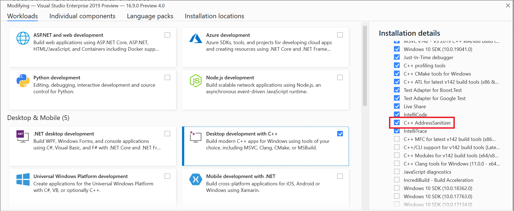
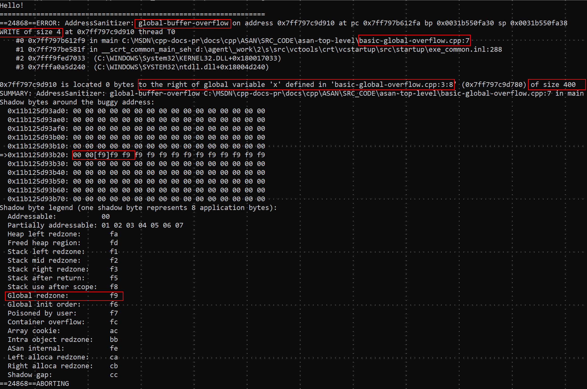
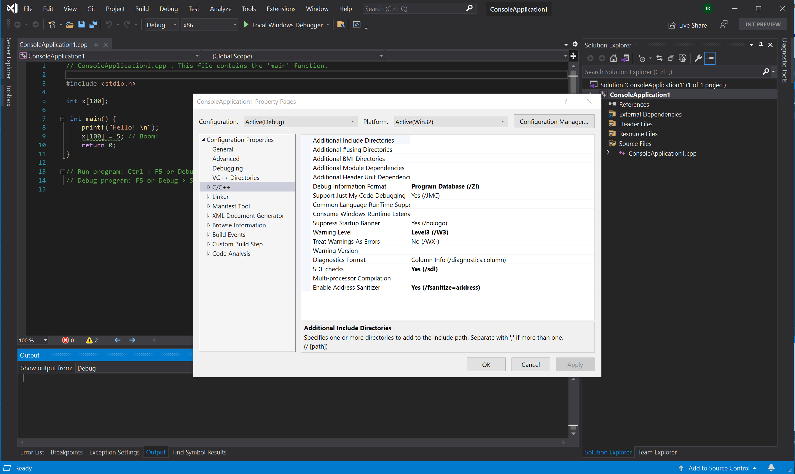

# Address Sanitizer

## Overview

The C & C++ languages are powerful, but can suffer from a class of bugs that affect **program correctness** and **program security**. Starting with Visual Studio 2019 16.9 the Microsoft Visual C++ compiler and IDE supports the Address Sanitizer. This compiler and runtime technology will light up [hard-to-find bugs](#error-types) with **zero false positives**.

Use this feature to reduce your time spent on:

- Basic correctness
- Cross platform portability
- Security
- Stress testing
- Integrating new code

The Address Sanitizer is a compiler and runtime [introduced by Google](https://www.usenix.org/conference/atc12/technical-sessions/presentation/serebryany). Compiling with `-fsanitize=address` is a powerful alternative to both [/RTC](../../build/reference/rtc-run-time-error-checks.md), and [/analyze](https://docs.microsoft.com/en-us/cpp/build/reference/analyze-code-analysis?view=msvc-160). It provides run-time bug-finding technologies which directly use your existing build systems and existing test assets.

 Projects can enable the Address Sanitizer with a project setting, or one extra compiler switch: `-fsanitize=address`. The new flag is compatible with all levels of optimization and configurations of x86 and x64, with several incompatibilities: [edit-and-continue](/visualstudio/debugger/edit-and-continue-visual-cpp), [incremental linking](../../build/reference/incremental-link-incrementally.md), and [/RTC](https://docs.microsoft.com/en-us/cpp/build/reference/rtc-run-time-error-checks?view=msvc-160).

The Address Sanitizer is integrated with the Visual Studio the project system, CMake system, and the IDE.

Microsoft's Address Sanitizer technology enables integration with the Visual Studio IDE. The functionality can optionally create a crash dump file when the sanitizer finds a bug at runtime. Set the `ASAN_SAVE_DUMPS=MyFileName.dmp` environment variable prior to running your program, and a crash dump file will be created with extra meta-data for efficient, [post-mortem debugging](#.\asan-offline-address-sanitizer-crash-dumps.md) debugging of **precisely diagnosed bugs**. These dump files facilitate extended use of the Address Sanitizer for local machine testing and:

- On-premise distributed testing, and
- Cloud-based workflows for testing

### Installing the Address Sanitizer

**The Address Sanitizer is installed by default with the Visual C++**. However, if you are upgrading from an older version of Visual Studio 2019 you will need to enable ASan support in the Installer after the upgrade:



You can click **Modify** on your existing Visual Studio installation from the Visual Studio Installer to get to the screen above.

Note: if you run Visual Studio on the new update but have not installed ASan, you will get the following error when you run your code:

`LNK 1356 – cannot find library 'clang_rt.asan_dynamic-i386.lib'`

### Using the Address Sanitizer

Start building your executables with the `-fsanitize=address` compiler switch using any of the following development methods:

- Command line
- Visual Studio project system
- Visual Studio CMake integration

 Recompile, then run your program normally. This code generation will light up [many types of precisely diagnosed bugs](#errors). These errors can be reported in three ways: in the debugger IDE, on the command line or stored in a [new type of dump file](#Address-Sanitizer-crash-dumps) for precise off-line processing.

Microsoft recommends using the Address Sanitizer in these **three standard workflows**:

- **Developer inner loop**
  - Visual Studio - debugger IDE
  - Visual Studio - [Command line](#Using-the-Address-Sanitizer-from-a-Developer-Command-Prompt)
  - Visual Studio - [Project system](#Using-the-Address-Sanitizer-from-Visual-Studio)
  - Visual Studio - [CMake]([CMake](#Using-the-Address-Sanitizer-from-Visual-Studio:-CMake))

- **CI/CD** - continuous integration / continuous development
  - Error reporting - [New Address Sanitizer dump files](Address Sanitizer crash dumps)

- **Fuzzing** - building with the [libFuzzer](https://llvm.org/docs/LibFuzzer.html) wrapper
  - [Azure OneFuzz](https://www.microsoft.com/security/blog/2020/09/15/microsoft-onefuzz-framework-open-source-developer-tool-fix-bugs/)
  - Local Machine

This article will cover the information needed to enable the three workflows listed above. The information will be specific to the **platform-dependent** Windows 10 implementation of the Address Sanitizer. This documentation is meant to supplement the excellent documentation from [Google, Apple, and GCC](#Google,-Apple-and-GCC-documentation) already published.

> [!NOTE] Current support is limited to x86 and x64 on Windows 10. Please [send us feedback](https://aka.ms/feedback/suggest?space=62) on what you would like to see in future releases. Your feedback would help us prioritize other sanitizers in the future: -fsanitize=thread, -fsanitize=leak, -fsanitize=memory, -fsanitize=hwaddress or -fsanitize=undefined.

## Using the Address Sanitizer from a Developer Command Prompt

Compile with `-fsanitize=address` to enable Address Sanitizer. The compiler flag `-fsanitize=address` is compatible with all existing C++ or C optimization levels (for example, `/Od`, `/O1`, `/O2`, `/O2 /GL` and `PGO`). The flag works with static and dynamic CRTs (for example, `/MD`, `/MDd`, `/MT`, and `/MTd`). The flag works with creating an EXE or a DLL. Debug information is required for optimal formatting of call stacks. In this example, `/Zi` is explicitly passed.

The Address Sanitizer libraries (.lib files) will be linked for you. For more detail, and for guidelines on partitioned build systems, see [building to target the Address Sanitizer runtime](./asan-building.md).

### Example - basic global buffer overflow

```cpp
// basic-global-overflow.cpp
#include <stdio.h>
int x[100];
int main() {
    printf("Hello!\n");
    x[100] = 5; // Boom!
    return 0;
}
```

Using a Developer Command Prompt for VS 2019, compile main.cpp using `-fsanitize=address -Zi`


Running the resulting **main.exe** at the command line, will result in the formatted error report seen below.

Consider the overlaid, red boxes that high light seven key pieces of information:



### Red highlights - from top to bottom

1. The memory safety bug is a global-buffer-overflow.
2. There were **4 bytes** (32 bits) **stored** outside any user-defined variable.
3. The store took place in function `main()` defined in file `basic-global-overflow.cpp` on line 7.
4. The variable, named `x`, defined in basic-global-overflow.cpp on line 3 starting at column 8
5. This global variable `x` is of size 400 bytes
6. The exact [shadow byte](./asan-shadowbytes.md) describing the address targeted by the store had a value of `0xf9`
7. The shadow byte legend says `0xf9` is an area of padding to the right of `int x[100]`

**Note:**  The function names in the call stack are produced through the [LLVM symbolizer](https://llvm.org/docs/CommandGuide/llvm-symbolizer.html) that is invoked by the runtime upon error.

## Using the Address Sanitizer from Visual Studio

Address Sanitizer is integrated with the Visual Studio IDE. You can turn on the Address Sanitizer for an MSBuild project by right-clicking on the project in Solution Explorer, choosing Properties, navigating under C/C++ > General, and changing the **Enable Address Sanitizer**



To build from the IDE, opt out of [these incompatible flags](./asan-known-issues.md#Incompatible-switches-and-functionality). For an existing project that is compiled in Debug mode, this could mean the following:

- Turn off [edit and continue](https://docs.microsoft.com/en-us/visualstudio/debugger/how-to-enable-and-disable-edit-and-continue?view=vs-2019)
- Turn off [runtime checks](https://docs.microsoft.com/en-us/cpp/build/reference/rtc-run-time-error-checks?view=msvc-160)
- Turn off [incremental linking](https://docs.microsoft.com/en-us/cpp/build/reference/incremental-link-incrementally?view=msvc-160)

To build and run the debugger, **hit F5**. The following VS window will result:


## Using the Address Sanitizer from Visual Studio: CMake

To enable the Address Sanitizer for [a CMake project created to target Windows](https://docs.microsoft.com/en-us/cpp/build/cmake-projects-in-visual-studio?view=msvc-160), take the following steps:

Open the Configurations dropdown at the top of the IDE and click on Manage Configurations.


That selection will open the CMake Project Settings UI, which is saved in a CMakeSettings.json file.

Click the **Edit JSON** link in the UI. This selection will switch the view to raw .json.

Add the following property: **“addressSanitizerEnabled”: true**

The following image is of CMakeSettings.json after that change:


Save this JSON file with `ctrl-s` then `hit F5`to recompile and run under the debugger.

The following screenshot captures the error from the CMake build.


## Address Sanitizer crash dumps

We introduced new functionality for Address Sanitizer for cloud and distributed workflows. This functionality allows you to view the Address Sanitizer error in the IDE. The error will be overlaid on top of your source, just as you would experience in a live debug session.

The difference can lead to efficiencies analyzing a bug. You don't need to rerun, or find remote data or look for a machine that went off-line.

To produce a new type of dump file that can be viewed in Visual Studio on another machine at a later date:

```makefile
set ASAN_SAVE_DUMPS=MyFileName.dmp
```

Starting with Visual Studio 16.9 you can display **a precisely diagnosed error**, stored in MyFileName.dmp, on top of your source code.

[This new crash dump functionality](./asan-offline-address-sanitizer-crash-dumps.md) is an enabler for cloud-based workflows and distributed testing.

## Error types

The following list of runtime errors can be exposed when you run your binaries compiled the Address Sanitizer(-fsanitize=address):

- [stack-use-after-scope](./examples-stack-use-after-scope.md)
- [stack-buffer-overflow](./examples-stack-buffer-overflow.md)
- [stack-buffer-underflow](./examples-stack-buffer-underflow.md)
- [stack-use-after-return](./examples-stack-use-after-return.md)
- [heap-buffer-overflow](./examples-heap-buffer-overflow.md)
- [heap-use-after-free](./examples-heap-use-after-free.md)
- [double-free](./examples-double-free.md)
- [dynamic-stack-buffer-overflow](./examples-dynamic-stack-buffer-overflow.md)
- [global-overflow](./examples-global-overflow.md)
- [calloc-overflow](./examples-calloc-overflow.md)
- [new-delete-type-mismatch](./examples-new-delete-type-mismatch.md)
- [memcpy-param-overlap](./examples-memcpy-param-overlap.md)
- [strcat-param-overlap](./examples-strcat-param-overlap.md)
- [allocation-size-too-big](./examples-allocation-size-too-big.md)
- [invalid-aligned-alloc-alignment](./examples-invalid-aligned-alloc-alignment.md)
- [use-after-poison](./examples-use-after-poison.md)
- [alloc-dealloc-mismatch](./examples-alloc-dealloc-mismatch.md)

NOTE:  All screenshots were generated with **`devenv.exe /debugexe example.exe`**

## Differences with Clang 12.0

Visual C++ currently differs in two functional areas:

- **stack-use-after-scope** - this setting is on by default and can't be turned off.
- **stack-use-after-return** - this functionality is not available by only setting ASAN_OPTIONS.

These decisions were made to reduce the test matrix required to ship this first version.

Features that could lead to false positives in Visual Studio 2019 16.9 were not shipped. That discipline enforced an effective testing integrity necessary when considering interop with decades of exiting code. The following functionalities may be considered to implementation later:

- [Initialization Order Fiasco](https://github.com/google/sanitizers/wiki/AddressSanitizerInitializationOrderFiasco)
- [Intra Object Overflow](https://github.com/google/sanitizers/wiki/AddressSanitizerIntraObjectOverflow)
- [Container Overflow](https://github.com/google/sanitizers/wiki/AddressSanitizerContainerOverflow)
- [Pointer Subtraction/Comparison](https://gcc.gnu.org/onlinedocs/gcc/Instrumentation-Options.html)

For more information, see [Building for the Address Sanitizer with MSVC](./asan-building.md) for further details.

[Provide feedback](https://aka.ms/feedback/suggest?space=62) about features you would like to see in future releases.

## Existing industry documentation

Extensive documentation already exists for these language and platform-dependent implementations of the Address Sanitizer technology.

- [Google](https://github.com/google/sanitizers/wiki/AddressSanitizer)
- [Apple](https://developer.apple.com/documentation/xcode/diagnosing_memory_thread_and_crash_issues_early)
- [GCC](https://gcc.gnu.org/onlinedocs/gcc/Instrumentation-Options.html)

This seminal paper on the [Address Sanitizer](https://www.usenix.org/system/files/conference/atc12/atc12-final39.pdf) describes the implementation.

## See also

- [Building for the Address Sanitizer with Visual Studio](./asan-building.md)

- [Address Sanitizer runtime](./address-sanitizer-runtime.md)

These articles provide structure for discussions about further details into the tools and the run times they target.

---
