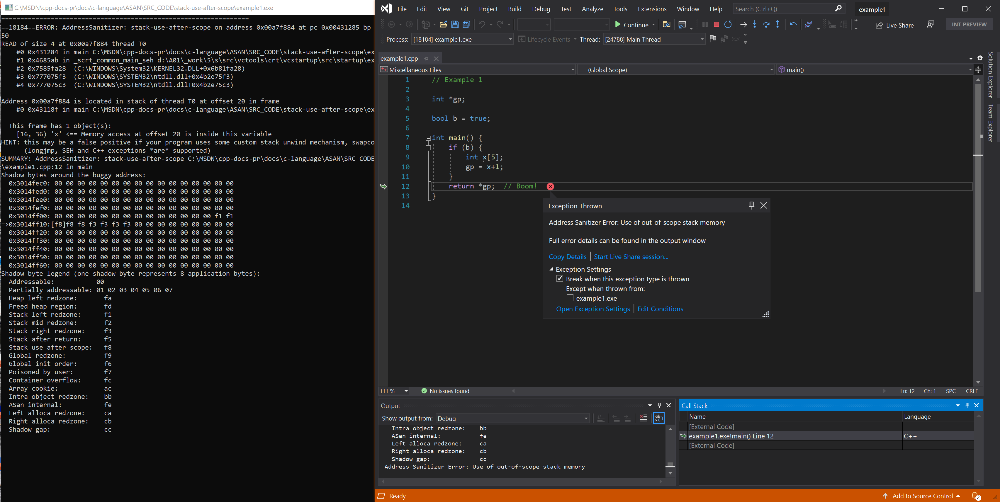

# Error: `stack-use-after-scope`

> Address Sanitizer Error: Use of out-of-scope stack memory

The use of a stack address outside the lexical scope of a variable's lifetime can happen many ways in C or C++.

Examples sourced from [LLVM compiler-rt test suite](https://github.com/llvm/llvm-project/tree/main/compiler-rt/test/asan/TestCases).

## Example 1 - simple nested local

```cpp
// example1.cpp
// stack-use-after-scope error
int *gp;

bool b = true;

int main() {
    if (b) {
        int x[5];
        gp = x+1;
    }
    return *gp;  // Boom!
}
```

To build and test this example, run these commands in a Visual Studio 2019 version 16.9 or later [developer command prompt](../build/building-on-the-command-line.md#developer_command_prompt_shortcuts):

```cmd
cl example1.cpp /fsanitize=address /Zi
devenv /debugexe example1.exe
```

### Resulting error - simple nested local



## Example 2 - lambda capture

```cpp
// example2.cpp
// stack-use-after-scope error
#include <functional>

int main() {
    std::function<int()> f;
    {
        int x = 0;
        f = [&x]() {
            return x;  // Boom!
        };
    }
    return f();  // Boom!
}
```

To build and test this example, run these commands in a Visual Studio 2019 version 16.9 or later [developer command prompt](../build/building-on-the-command-line.md#developer_command_prompt_shortcuts):

```cmd
cl example2.cpp /fsanitize=address /Zi
devenv /debugexe example2.exe
```

### Resulting error - lambda capture


## Example 3 - destructor ordering with locals

```cpp
// example3.cpp
// stack-use-after-scope error
#include <stdio.h>

struct IntHolder {
    explicit IntHolder(int* val = 0) : val_(val) { }
    ~IntHolder() {
        printf("Value: %d\n", *val_);  // Bom!
    }
    void set(int* val) { val_ = val; }
    int* get() { return val_; }

    int* val_;
};

int main(int argc, char* argv[]) {
    // It's incorrect to use "x" inside the IntHolder destructor,
    // because the lifetime of "x" ends earlier. Per the C++ standard,
    // local lifetimes end in reverse order of declaration.
    IntHolder holder;
    int x = argc;
    holder.set(&x);
    return 0;
}
```

To build and test this example, run these commands in a Visual Studio 2019 version 16.9 or later [developer command prompt](../build/building-on-the-command-line.md#developer_command_prompt_shortcuts):

```cmd
cl example3.cpp /fsanitize=address /Zi /O1
devenv /debugexe example3.exe
```

### Resulting error - destructor ordering


## Example 4 - temporaries

```cpp
// example4.cpp
// stack-use-after-scope error
#include <iostream>

struct A {
    A(const int& v) {
        p = &v;
    }
    void print() {
        std::cout << *p;
    }
    const int* p;
};

void explicit_temp() {
    A a(5);     // the temp for 5 is no longer live;
    a.print();
}

void temp_from_conversion() {
    double v = 5;
    A a(v);     // local v is no longer live.
    a.print();
}

void main() {
    explicit_temp();
    temp_from_conversion(); 
}
```

To build and test this example, run these commands in a Visual Studio 2019 version 16.9 or later [developer command prompt](../build/building-on-the-command-line.md#developer_command_prompt_shortcuts):

```cmd
cl example4.cpp /EHsc /fsanitize=address /Zi
devenv /debugexe example4.exe
```

### Resulting error - temporaries


## See also

[AddressSanitizer overview](./asan.md)\
[AddressSanitizer known issues](./asan-known-issues.md)\
[AddressSanitizer build and language reference](./asan-building.md)\
[AddressSanitizer runtime reference](./asan-runtime.md)\
[AddressSanitizer shadow bytes](./asan-shadowbytes.md)\
[AddressSanitizer cloud or distributed testing](./asan-offline-crash-dumps.md)\
[AddressSanitizer debugger integration](./asan-debugger-integration.md)\
[AddressSanitizer error examples](./asan-error-examples.md)
