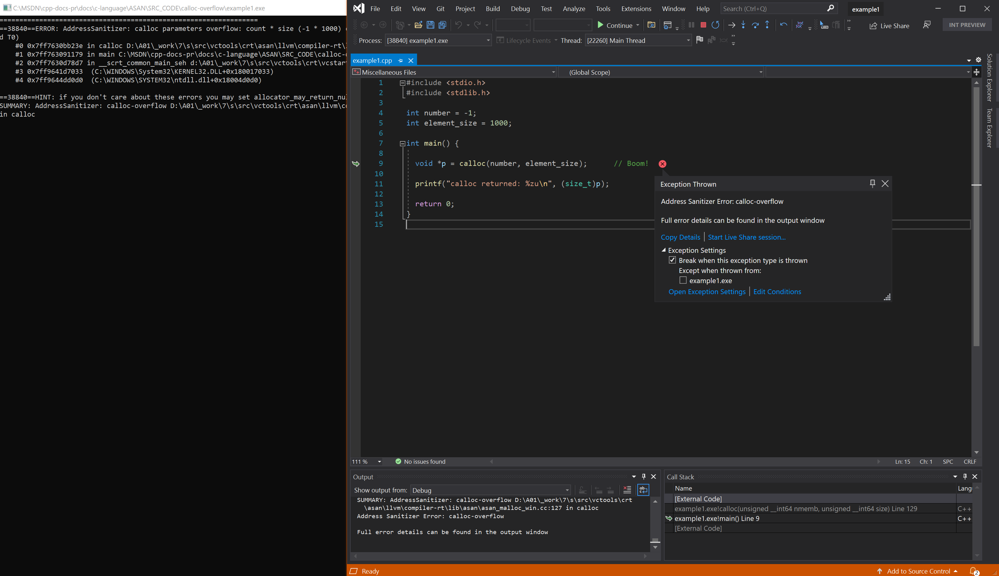

# `calloc` - overflow

The CRT function [`calloc`](../c-runtime-library/reference/calloc.md) creates an array in memory with elements initialized to 0. The arguments can create an internal error that leads to a NULL pointer as the return value. Example sourced from [LLVM compiler-rt test suite](https://github.com/llvm/llvm-project/tree/main/compiler-rt/test/asan/TestCases).

## Example

```cpp
// example1.cpp
#include <stdio.h>
#include <stdlib.h>

int number = -1;
int element_size = 1000;

int main() {

  void *p = calloc(number, element_size);      // Boom!

  printf("calloc returned: %zu\n", (size_t)p);

  return 0;
}
```

To build and test this example, run these commands in a [developer command prompt](../build/building-on-the-command-line.md#developer_command_prompt_shortcuts):

```cmd
cl example1.cpp /fsanitize=address /Zi
devenv /debugexe example1.exe
```

## Resulting error


