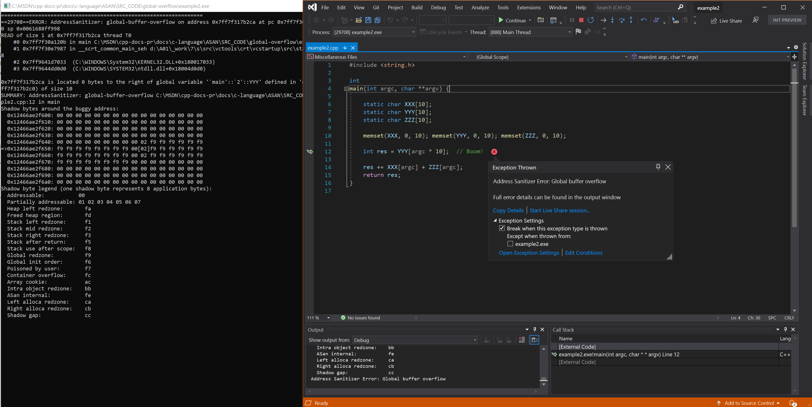

# Global buffer overflow

The compiler generates meta-data and shadow bytes for any variable in the `.data` or `.bss` sections. These variables have language scope globals or file statics that are allocated in memory before main() starts. Global variables in 'C' are treated much differently than 'C++'. This difference is because of the complex rules for linking.  

In 'C', a global variable can be declared in several source files and each definition can have different types.  The compiler can't see all the possible definitions. The linker will see all the different definitions. The linker defaults to selecting the largest size of all the different declarations.

In C++, a global is allocated by the compiler. There can only be one definition so the size of each definition is known at compile time.

## Example - globals in 'C' with multiple type definitions

```cpp
// Here are 3 'C' files that are compiled in 3 different permutations:
// 
//    > cl a.c b.c c.c main.c ..
//    > cl b.c a.c c.c main.c ..
//    > cl b.c b.c a.c main.c ..
//
// Address Sanitizer reports a buffer overflow in main.c @line #2 in all cases.
  
// file: a.c 
int x;

// file: b.c  
char* x; > b.c

// file: c.c
float* x[3];

// main.c

double x[5];
 
int main() { 
    int rc = (int) x[5];  // Boom!
    return rc; 
}
```

## Resulting error


## Example - simple function level static

```cpp
#include <string.h>
int main(int argc, char **argv) {

    static char XXX[10];
    static char YYY[10];
    static char ZZZ[10];

    memset(XXX, 0, 10); memset(YYY, 0, 10); memset(ZZZ, 0, 10);

    int res = YYY[argc * 10];  // Boom!

    res += XXX[argc] + ZZZ[argc];
    return res;
}
```

## Resulting error - simple function level static

`devenv /debugexe example2.exe`



## Example - all global scopes in C++

```cpp
// Run 4 different ways with the choice of one of these flags:
//
// -g : Global
// -c : File static
// -f : Function static
// -l : String literal

#include <string.h>

struct C {
  static int array[10];
};

// normal global
int global[10];

// class static
int C::array[10];

int main(int argc, char **argv) {
  int one = argc - 1;
  switch (argv[1][1]) {
  case 'g': return global[one * 11];     //Boom! simple global
  case 'c': return C::array[one * 11];   //Boom! class static
  case 'f':
    static int array[10];
    memset(array, 0, 10);
    return array[one * 11];              //Boom! function static
  case 'l':
    // literal global ptr created by compiler

    const char *str = "0123456789";
    return str[one * 11];                //Boom! .rdata string literal allocated by compiler
  }
  return 0;
}
```

## Resulting error - all global scopes in C++

`devenv /debugexe example3.exe -l`

![example3]
