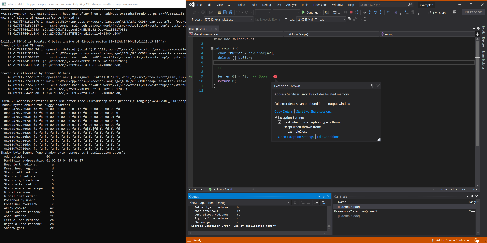

# Heap use after free

We show three examples where storage in the heap can be allocated via `malloc`, `realloc` (C), and `new` (C++), along with a mistaken use of `volatile`. Examples sourced from [LLVM compiler-rt test suite](https://github.com/llvm/llvm-project/tree/main/compiler-rt/test/asan/TestCases).

## Example - `malloc`

```cpp
// example1.cpp
#include <stdlib.h>

int main() {
  char *x = (char*)malloc(10 * sizeof(char));
  free(x);

  // ...

  return x[5];   // Boom!
}
```

To build and test this example, run these commands in a [developer command prompt](../build/building-on-the-command-line.md#developer_command_prompt_shortcuts):

```cmd
cl example1.cpp /fsanitize=address /Zi
devenv /debugexe example1.exe
```

## Resulting error


## Example - `operator new`

```cpp
// example2.cpp
#include <windows.h>

int main() {
  char *buffer = new char[42];
  delete [] buffer;

  // ...

  buffer[0] = 42;  // Boom!
  return 0;
}
```

To build and test this example, run these commands in a [developer command prompt](../build/building-on-the-command-line.md#developer_command_prompt_shortcuts):

```cmd
cl example2.cpp /fsanitize=address /Zi
devenv /debugexe example2.exe
```

## Resulting error - operator new



## Example - `realloc`

```cpp
// example3.cpp

#include <malloc.h>

int main() {
  char *buffer = (char*)realloc(0, 42);
  free(buffer);

  // ...

  buffer[0] = 42;  // Boom!
  return 0;
}
```

To build and test this example, run these commands in a [developer command prompt](../build/building-on-the-command-line.md#developer_command_prompt_shortcuts):

```cmd
cl example3.cpp /fsanitize=address /Zi
devenv /debugexe example3.exe
```

## Resulting error - realloc


## Example - volatile

```cpp
// example4.cpp
#include <stdlib.h>

int main() {

  volatile char *x = (char*)malloc(sizeof(char));
  free((void*)x);

      //...

  *x = 42;        // Boom!
}
```

To build and test this example, run these commands in a [developer command prompt](../build/building-on-the-command-line.md#developer_command_prompt_shortcuts):

```cmd
cl example4.cpp /fsanitize=address /Zi
devenv /debugexe example4.exe
```

## Resulting error - volatile


