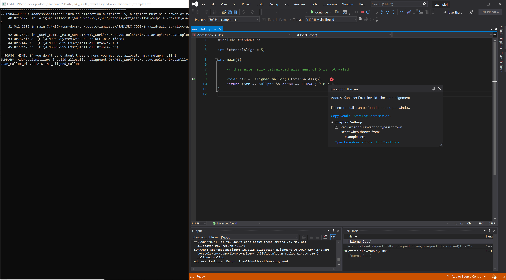

# Example: `invalid-aligned-alloc-alignment` error

The [`_aligned_malloc`](../c-runtime-library/reference/aligned-malloc.md) function requires a power of 2 for expressing the alignment. We simulate the "external" calculation of some alignment factor using an unoptimized global variable. Example sourced from [LLVM compiler-rt test suite](https://github.com/llvm/llvm-project/tree/main/compiler-rt/test/asan/TestCases).

## Example

```cpp
// example1.cpp
// invalid-aligned-alloc-alignment error
#include <Windows.h>

int ExternalAlign = 5;

int main(){

    // this externally calculated alignment of 5 isn't valid.

    void* ptr = _aligned_malloc(8,ExternalAlign); 
    return (ptr == nullptr && errno == EINVAL) ? 0 : -1;
}
```

To build and test this example, run these commands in a Visual Studio 2019 version 16.9 or later [developer command prompt](../build/building-on-the-command-line.md#developer_command_prompt_shortcuts):

```cmd
cl example1.cpp /fsanitize=address /Zi
devenv /debugexe example1.exe
```

### Resulting error



## See also

[AddressSanitizer overview](./asan.md)\
[AddressSanitizer known issues](./asan-known-issues.md)\
[AddressSanitizer build and language reference](./asan-building.md)\
[AddressSanitizer runtime reference](./asan-runtime.md)\
[AddressSanitizer shadow bytes](./asan-shadowbytes.md)\
[AddressSanitizer cloud or distributed testing](./asan-offline-crash-dumps.md)\
[AddressSanitizer debugger integration](./asan-debugger-integration.md)\
[AddressSanitizer error examples](./asan-examples.md)
