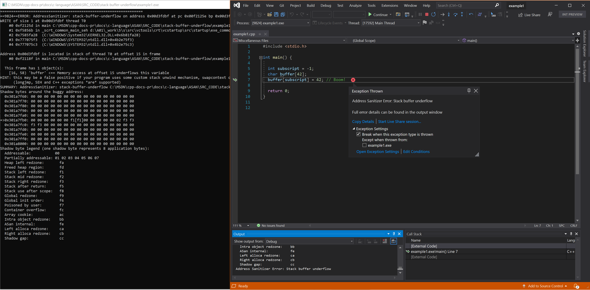
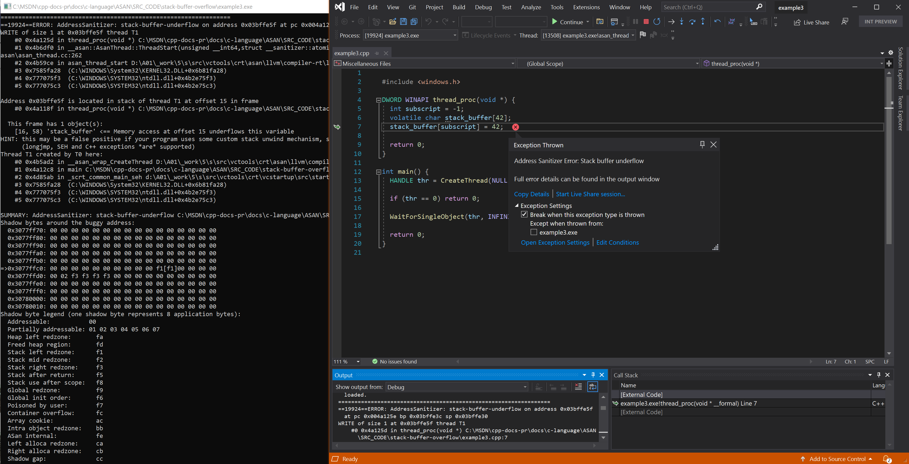

# Stack buffer underflow

Examples sourced from [LLVM compiler-rt test suite](https://github.com/llvm/llvm-project/tree/main/compiler-rt/test/asan/TestCases).

## Example - local array underflow

```cpp
#include <stdio.h>

int main() {
  int subscript = -1;
  char buffer[42];
  buffer[subscript] = 42; // Boom!
}

```

From a **Developer Command Prompt**:
```
 cl example1.cpp /fsanitize=address /Zi
 devenv /debugexe example1.exe
```

## Resulting error



## Example - stack underflow on thread

```cpp

#include <windows.h>

DWORD WINAPI thread_proc(void *) {
  int subscript = -1;
  volatile char stack_buffer[42];
  stack_buffer[subscript] = 42;
  return 0;
}

int main() {
  HANDLE thr = CreateThread(NULL, 0, thread_proc, NULL, 0, NULL);

  if (thr == 0) return 0;

  WaitForSingleObject(thr, INFINITE);
}

```

From a **Developer Command Prompt**:
```
 cl example2.cpp /fsanitize=address /Zi
 devenv /debugexe example2.exe
```

## Resulting error  - stack underflow on thread


