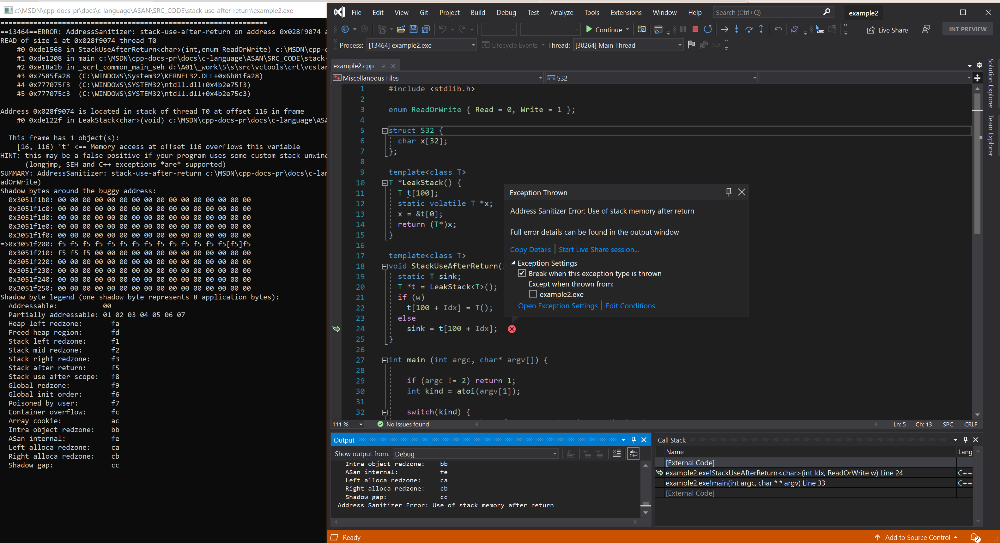

# Stack Use After Return

This functionality requires code generation that is activated under an extra compiler flag `-fsanitize-address-use-after-return`. A complete command-line example would be:

> cl -fsanitize=address -fsanitize-address-use-after-return /Zi file.cpp my3dparty.lib -Fe My.exe.

When the binary is created, the functionality in the binary is activated with an environment variable `ASAN_OPTIONS=detect_stack_use_after_return=1`.  This environment variable is there to allow for debugging and making quick progress in "getting through an existing source base"

Consider the [Clang summary](https://github.com/google/sanitizers/wiki/AddressSanitizerUseAfterReturn) of the algorithm supporting use after return, and the larger performance costs.

## Example - Simple 'C'

```cpp
    char *x;
    
    void foo() {
        char stack_buffer[42];
        x = &stack_buffer[13];
    }
    
    int main() {
        foo();
        *x = 42;  // Boom!
        return 0;
    }
```

## Resulting error `c:> example1.exe`


## Example - C++ and templates

```cpp
    #include <stdlib.h>

    enum ReadOrWrite { Read = 0, Write = 1 };

    struct S32 {
      char x[32];
    };
    
    template<class T>
    T *LeakStack() {
      T t[100];
      static volatile T *x;
      x = &t[0];
      return (T*)x;
    }
    
    template<class T>
    void StackUseAfterReturn(int Idx, ReadOrWrite w) {
      static T sink;
      T *t = LeakStack<T>();
      if (w)
        t[100 + Idx] = T();
      else
        sink = t[100 + Idx]; // Boom!
    }
    
    int main (int argc, char* argv[]) {
    
        if (argc != 2) return 1;
        int kind = atoi(argv[1]);
    
        switch(kind) {
            case 1: StackUseAfterReturn<char>(0, Read); break;
            case 2: StackUseAfterReturn<S32>(0, Write); break;
        }
        return 0;
    }

```

## Resulting error

Running this example as `c:>example2.exe 1`


