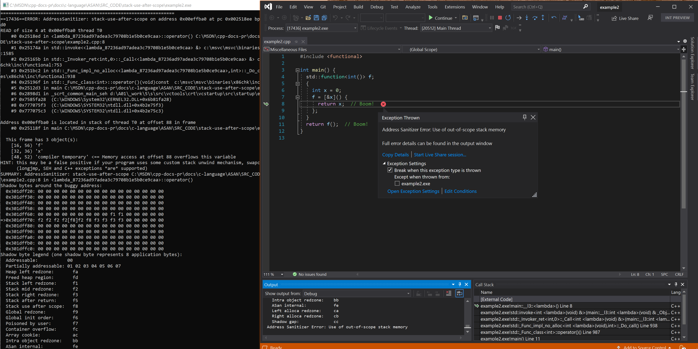
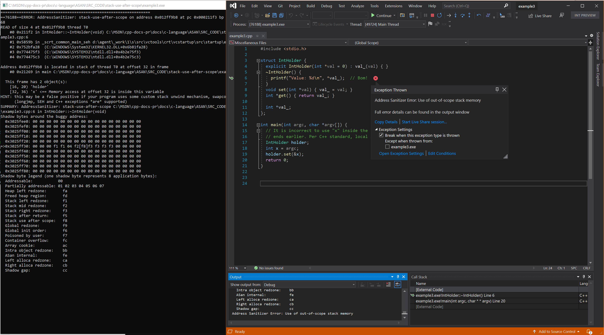
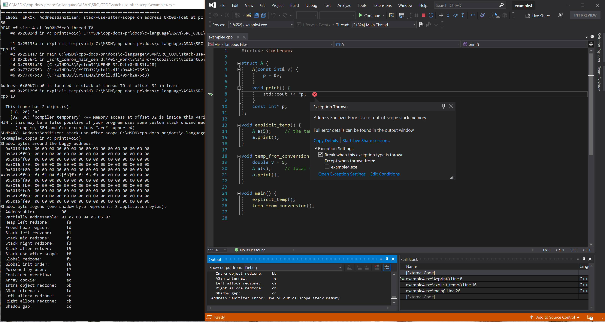

# Stack use after scope

The use of a stack address outside the lexical scope of a variable's lifetime can happen many ways in C or C++.

Examples sourced from [LLVM compiler-rt test suite](https://github.com/llvm/llvm-project/tree/main/compiler-rt/test/asan/TestCases).

## Example 1 - simple nested local

```cpp
int *gp;
bool b = true;

int main() {
    if (b) {
        int x[5];
        gp = x+1;
    }
    return *gp;  // Boom!
}

```

From a **Developer Command Prompt**:
```
 cl example1.cpp /fsanitize=address /Zi
 devenv /debugexe example1.exe
```

## Resulting error - simple nested local


## Example 2 - lambda capture

```cpp
#include <functional>

int main() {
  std::function<int()> f;
  {
    int x = 0;
    f = [&x]() {
      return x;  // Boom!
    };
  }
  return f();  // Boom!
}
```

From a **Developer Command Prompt**:
```
 cl example2.cpp /fsanitize=address /Zi
 devenv /debugexe example2.exe
```

## Resulting Error - lambda capture



## Example 3 - destructor ordering with locals

```cpp
// cl /O1 -fsanitize=address. This will not fire with /Od

#include <stdio.h>

struct IntHolder {
  explicit IntHolder(int *val = 0) : val_(val) { }
  ~IntHolder() {
    printf("Value: %d\n", *val_);  // Bom!
  }
  void set(int *val) { val_ = val; }
  int *get() { return val_; }

  int *val_;
};

int main(int argc, char *argv[]) {
  // It is incorrect to use "x" inside the IntHolder destructor, because the lifetime of "x"
  // ends earlier. Per C++ standard, local lLifetimes end in reverse order of declaration.

  IntHolder holder;
  int x = argc;
  holder.set(&x);

       // .. dtor for holder is inserted by compiler generated code and x is out of scope

  return 0;
}

```

From a **Developer Command Prompt**:
```
 cl example3.cpp /fsanitize=address /Zi /O1
 devenv /debugexe example3.exe
```

## Resulting error - destructor ordering relative to locals



## Example 4 - temporaries

```cpp
#include <iostream>

struct A {
    A(const int& v) {
        p = &v;
    }
    void print() {
        std::cout << *p;
    }
    const int* p;
};

void explicit_temp() {
    A a(5);     // the temp for 5 is no longer live;
    a.print();
}

void temp_from_conversion() {
    double v = 5;
    A a(v);     // local v is no longer live.
    a.print();
}

void main() {
    explicit_temp();
    temp_from_conversion(); 
}

```

From a **Developer Command Prompt**:
```
 cl example4.cpp /EHsc /fsanitize=address /Zi
 devenv /debugexe example4.exe
```

## Resulting error - temporaries


