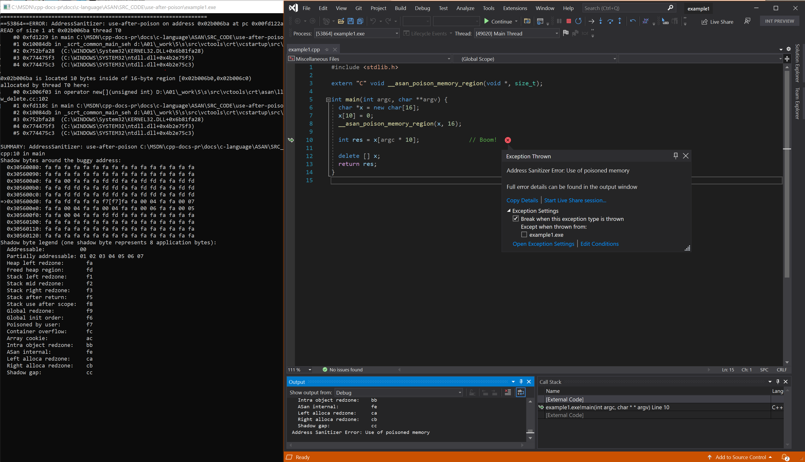

# Use after poison

A developer can manually poison memory to customize debugging. Example sourced from [LLVM compiler-rt test suite](https://github.com/llvm/llvm-project/tree/main/compiler-rt/test/asan/TestCases).

## Example

```cpp
// example1.cpp
#include <stdlib.h>

extern "C" void __asan_poison_memory_region(void *, size_t);

int main(int argc, char **argv) {
  char *x = new char[16];
  x[10] = 0;
  __asan_poison_memory_region(x, 16);

  int res = x[argc * 10];              // Boom!
 
  delete [] x;
  return res;
}
```

To build and test this example, run these commands in a [developer command prompt](../build/building-on-the-command-line.md#developer_command_prompt_shortcuts):

```cmd
cl example1.cpp /fsanitize=address /Zi
devenv /debugexe example1.exe
```

### Resulting error


